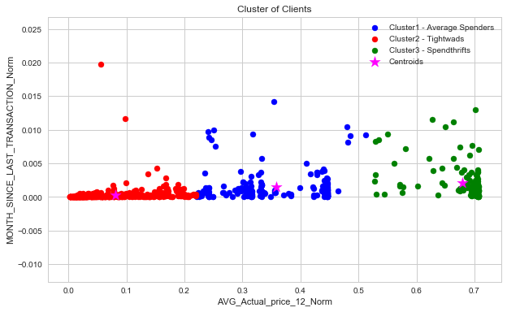
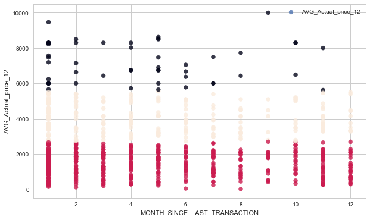
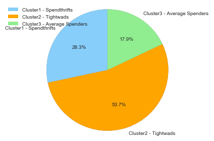
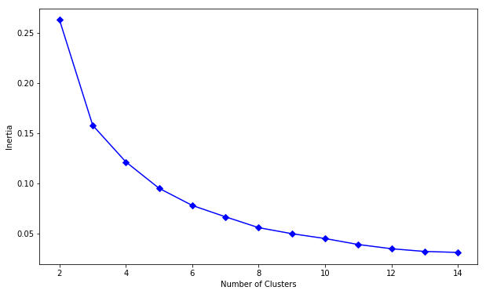
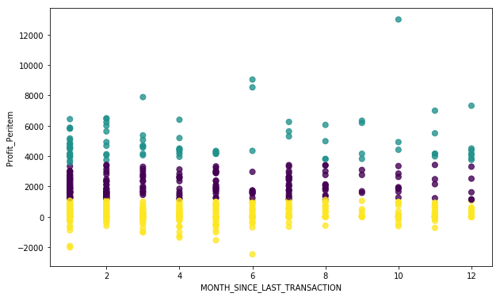

While doing Customer segmentation and Recommendation below steps has been followed.

1.  **Extrapolatory Data Analysis or EDA**
2.  **Data Preprocessing**
3.  **K-means clustering**
4.  **Customer Segmentation**
5.  **Recommendation**


The dataset has been uploaded in the dataframe named Supermarket

```python
import numpy as np
import pandas as pd
import matplotlib.pyplot as plt
from pandas import DataFrame,Series
%matplotlib inline

your_local_path = "C:/Users/SaikatPC/Desktop/attachment_ML_attachment_Project/Customer_Segmentation_Reco/"
Supermarket = pd.read_csv(your_local_path+'Supermarket_Purchase.csv')

Supermarket.head()
```

<table border="1" class="dataframe">
  <thead>
    <tr style="text-align: right;">
      <th></th>
      <th>Cust_id</th>
      <th>AVG_Actual_price_12</th>
      <th>Purchase_Value</th>
      <th>No_of_Items</th>
      <th>Total_Discount</th>
      <th>MONTH_SINCE_LAST_TRANSACTION</th>
    </tr>
  </thead>
  <tbody>
    <tr>
      <th>0</th>
      <td>1</td>
      <td>300.000000</td>
      <td>1200.00</td>
      <td>4</td>
      <td>0.00</td>
      <td>11</td>
    </tr>
    <tr>
      <th>1</th>
      <td>2</td>
      <td>2563.282500</td>
      <td>41012.52</td>
      <td>16</td>
      <td>78737.48</td>
      <td>2</td>
    </tr>
    <tr>
      <th>2</th>
      <td>4</td>
      <td>3510.000000</td>
      <td>7020.00</td>
      <td>2</td>
      <td>780.00</td>
      <td>4</td>
    </tr>
    <tr>
      <th>3</th>
      <td>8</td>
      <td>4530.000000</td>
      <td>13590.00</td>
      <td>3</td>
      <td>1510.00</td>
      <td>1</td>
    </tr>
    <tr>
      <th>4</th>
      <td>9</td>
      <td>2428.076923</td>
      <td>33455.00</td>
      <td>15</td>
      <td>17445.00</td>
      <td>6</td>
    </tr>
  </tbody>
</table>
</div>

# 1. EDA ( Extrapolatory Data Analysis ) #

After creating the dataset extrapolatory data analysis has been performed on the **Supermarket** dataset.

The dataset has total 702 rows and 6 columns
The columns are as follow : 

1.  **Cust_id**
2.  **AVG_Actual_price_12**
3.  **Purchase_Value** 
4.  **No_of_Items** 
5.  **Total_Discount** 
6.  **MONTH_SINCE_LAST_TRANSACTION**

Purchase value ranges from **302721.4 (max)** to **45.0 (min)**. Maximum number of items sold is **172** and minimum is **1**.

**21.65% ( highest )** of the total customers made a repetitive purchase in *1 month* and **2.85% ( lowest )** in *9 months*. 
This is concluded from the plot drawn below.

```python
from matplotlib.pyplot import show
import seaborn as sns
sns.set(style="darkgrid")
plt.figure(figsize=(10, 6))
total=Supermarket.shape[0]
ax = sns.countplot(x='MONTH_SINCE_LAST_TRANSACTION', data=Supermarket)
for p in ax.patches:
    height = p.get_height()
    ax.text((p.get_x() + p.get_width()/2),
           height + 2,
           '{:1.2f}'.format((height/total)*100),
            ha="center")
show()
```


Below observations can be drawn from the normal distribution of all the columns.

1.  **AVG_Actual_price_12** is *positively skewed*
2.  **Purchase_Value** is highly *positively skewed*
3.  **No_of_Items is highly** *positively skewed*
4.  **Total_Discount is highly** *positively skewed*
5.  **MONTH_SINCE_LAST_TRANSACTION** is *moderately positively skewed*.


```python
f,ax=plt.subplots(3,2,figsize=(12,18))
sns.distplot(Supermarket['AVG_Actual_price_12'],ax=ax[0,0])
ax[0,0].set_title('AVG_Actual_price_12 distribution')
sns.distplot(Supermarket['Purchase_Value'],ax=ax[0,1])
ax[0,1].set_title('Purchase_Value distribution')
sns.distplot(Supermarket['No_of_Items'],ax=ax[1,0])
ax[1,0].set_title('No_of_Items distribution')
sns.distplot(Supermarket['Total_Discount'],ax=ax[1,1])
ax[1,1].set_title('Total_Discount distribution')
sns.distplot(Supermarket['MONTH_SINCE_LAST_TRANSACTION'],ax=ax[2,0])
ax[2,0].set_title('MONTH_SINCE_LAST_TRANSACTION distribution')
```


Below conclusions can be drawn from the **pairplot** : 

1.  **Purchase_Value** and **No_of_Items** are *positively correlated*
2.  **Purchase_Value** and **Total_Discount** are *positively correlated*
3.  **Total_Discount** and **No_of_Items** are *positively correlated*


```python
import seaborn as sns
sns.pairplot(Supermarket)
```


**Heat map** clearly depicts some strong positive and negative correlations among several predictors. 

Positive Correlations :

1.  **Purchase_Value** and **No_of_items** are highly positively correlated *( corr -> 0.89)*
2.  **No_of_items** and **Total_Discount** are highly positively correlated *( corr -> 0.82)*
3.  **Total_Discount** and **Purchase_Value** are positively correlated *( corr -> 0.74)*
4.  **AVG_Actual_price_12** is slightly positively correlated  with **Purchase_Value** *(corr -> 0.019)*


Negative Correlations:

1.  **MONTH_SINCE_LAST_TRANSACTION** is lowly negatively correlated with **Total_Discount** *(corr->-0.23)*, **No_of_items** *(corr->-0.29)*
2.  **Purchase_Value** *(corr->-0.31)*, and **AVG_Actual_price_12** *(corr->-0.064)*
3.  **AVG_Actual_price_12** is lowly negatively correlated with **No_of_items** *(corr->-0.2)* and **Total_Discount** *(corr->-0.18)*


```python
corr=Supermarket.corr()
plt.figure(figsize=(12, 8))

sns.heatmap(corr, 
     vmax=.8, 
      linewidths=0.01,
         square=True,
         annot=True,
         cmap='Blues',
         linecolor="lightblue")
plt.title('Correlation between features');
```


# 2. Data Preprocessing #

In data preprocessing stage, we will normalize the data using min max scaler function.

```python
from sklearn.preprocessing import MinMaxScaler
from sklearn.preprocessing import Normalizer
scld = Normalizer()
Super_scld = scld.fit_transform(Supermarket)
Supermarket_Norm = pd.DataFrame(Super_scld, columns=Supermarket.columns)
Supermarket_Norm.columns =['Cust_id_Norm','AVG_Actual_price_12_Norm','Purchase_Value_Norm','No_of_Items_Norm','Total_Discount_Norm','MONTH_SINCE_LAST_TRANSACTION_Norm']

Supermarket_Norm.head()
```

<table border="1" class="dataframe">
  <thead>
    <tr style="text-align: right;">
      <th></th>
      <th>Cust_id_Norm</th>
      <th>AVG_Actual_price_12_Norm</th>
      <th>Purchase_Value_Norm</th>
      <th>No_of_Items_Norm</th>
      <th>Total_Discount_Norm</th>
      <th>MONTH_SINCE_LAST_TRANSACTION_Norm</th>
    </tr>
  </thead>
  <tbody>
    <tr>
      <th>0</th>
      <td>0.000808</td>
      <td>0.242525</td>
      <td>0.970099</td>
      <td>0.003234</td>
      <td>0.000000</td>
      <td>0.008893</td>
    </tr>
    <tr>
      <th>1</th>
      <td>0.000023</td>
      <td>0.028861</td>
      <td>0.461772</td>
      <td>0.000180</td>
      <td>0.886529</td>
      <td>0.000023</td>
    </tr>
    <tr>
      <th>2</th>
      <td>0.000507</td>
      <td>0.445021</td>
      <td>0.890042</td>
      <td>0.000254</td>
      <td>0.098894</td>
      <td>0.000507</td>
    </tr>
    <tr>
      <th>3</th>
      <td>0.000555</td>
      <td>0.314485</td>
      <td>0.943456</td>
      <td>0.000208</td>
      <td>0.104828</td>
      <td>0.000069</td>
    </tr>
    <tr>
      <th>4</th>
      <td>0.000238</td>
      <td>0.064221</td>
      <td>0.884861</td>
      <td>0.000397</td>
      <td>0.461408</td>
      <td>0.000159</td>
    </tr>
  </tbody>
</table>
</div>


An array has been created by choosing column **AVG_Actual_price_12_Norm** and **MONTH_SINCE_LAST_TRANSACTION_Norm** from *Supermarket_head* dataframe.

```python
X = Supermarket_Norm.iloc[:,[1,5]].values
X

    array([[2.42524688e-01, 8.89257189e-03],
           [2.88607651e-02, 2.25185988e-05],
           [4.45021230e-01, 5.07146701e-04],
           ...,
           [2.46790487e-01, 8.53343469e-03],
           [5.70559718e-01, 1.82579110e-03],
           [5.71776798e-01, 1.65333050e-03]])
```
A dataframe has been created using two columns named **number of clusters** (starting from 2 to 15) and also **inertia**. 

```python
from sklearn.cluster import KMeans
num_of_clusters = range(2,15)
error=[]

for num_clusters in num_of_clusters:
    clusters = KMeans(num_clusters)
    clusters.fit(X)
    error.append(clusters.inertia_/100)

df = pd.DataFrame({"Cluster_Numbers":num_of_clusters, "Error_Term":error})
df
```
<table border="1" class="dataframe">
  <thead>
    <tr style="text-align: right;">
      <th></th>
      <th>Cluster_Numbers</th>
      <th>Error_Term</th>
    </tr>
  </thead>
  <tbody>
    <tr>
      <th>0</th>
      <td>2</td>
      <td>0.088315</td>
    </tr>
    <tr>
      <th>1</th>
      <td>3</td>
      <td>0.030073</td>
    </tr>
    <tr>
      <th>2</th>
      <td>4</td>
      <td>0.014520</td>
    </tr>
    <tr>
      <th>3</th>
      <td>5</td>
      <td>0.006992</td>
    </tr>
    <tr>
      <th>4</th>
      <td>6</td>
      <td>0.004769</td>
    </tr>
    <tr>
      <th>5</th>
      <td>7</td>
      <td>0.003358</td>
    </tr>
    <tr>
      <th>6</th>
      <td>8</td>
      <td>0.002288</td>
    </tr>
    <tr>
      <th>7</th>
      <td>9</td>
      <td>0.001750</td>
    </tr>
    <tr>
      <th>8</th>
      <td>10</td>
      <td>0.001456</td>
    </tr>
    <tr>
      <th>9</th>
      <td>11</td>
      <td>0.001242</td>
    </tr>
    <tr>
      <th>10</th>
      <td>12</td>
      <td>0.001044</td>
    </tr>
    <tr>
      <th>11</th>
      <td>13</td>
      <td>0.000840</td>
    </tr>
    <tr>
      <th>12</th>
      <td>14</td>
      <td>0.000761</td>
    </tr>
  </tbody>
</table>
</div>

Using below python script **the optimum number of clusters** has been calculated using elbow curve. 
Clearly, the elbow was at **cluster number 3**.

```python
import matplotlib.pyplot as plt
%matplotlib inline
plt.figure(figsize=(10,6))
plt.plot(df.Cluster_Numbers, df.Error_Term, marker = "D", color='blue')
plt.xlabel('Number of Clusters')
plt.ylabel('Inertia')
plt.show()
```


# 3. K-means Clustering # 

After finding the elbow point (**at cluser number: 3**) *kmeans* has been calculated.

```python
kmeans =KMeans(n_clusters = 3, init = 'k-means++', max_iter = 300, n_init = 10, random_state = 0)
y_kmeans = kmeans.fit_predict(X)
```
A new column named **Cluster** has been added at the end of the cluster **Supermarket_Norm**. 

```python
Supermarket_Norm['Cluster'] = y_kmeans
Supermarket_Norm.head(10)
```
<table border="1" class="dataframe">
  <thead>
    <tr style="text-align: right;">
      <th></th>
      <th>Cust_id_Norm</th>
      <th>AVG_Actual_price_12_Norm</th>
      <th>Purchase_Value_Norm</th>
      <th>No_of_Items_Norm</th>
      <th>Total_Discount_Norm</th>
      <th>MONTH_SINCE_LAST_TRANSACTION_Norm</th>
      <th>Cluster</th>
    </tr>
  </thead>
  <tbody>
    <tr>
      <th>0</th>
      <td>0.000808</td>
      <td>0.242525</td>
      <td>0.970099</td>
      <td>0.003234</td>
      <td>0.000000</td>
      <td>0.008893</td>
      <td>0</td>
    </tr>
    <tr>
      <th>1</th>
      <td>0.000023</td>
      <td>0.028861</td>
      <td>0.461772</td>
      <td>0.000180</td>
      <td>0.886529</td>
      <td>0.000023</td>
      <td>1</td>
    </tr>
    <tr>
      <th>2</th>
      <td>0.000507</td>
      <td>0.445021</td>
      <td>0.890042</td>
      <td>0.000254</td>
      <td>0.098894</td>
      <td>0.000507</td>
      <td>0</td>
    </tr>
    <tr>
      <th>3</th>
      <td>0.000555</td>
      <td>0.314485</td>
      <td>0.943456</td>
      <td>0.000208</td>
      <td>0.104828</td>
      <td>0.000069</td>
      <td>0</td>
    </tr>
    <tr>
      <th>4</th>
      <td>0.000238</td>
      <td>0.064221</td>
      <td>0.884861</td>
      <td>0.000397</td>
      <td>0.461408</td>
      <td>0.000159</td>
      <td>1</td>
    </tr>
    <tr>
      <th>5</th>
      <td>0.000389</td>
      <td>0.028954</td>
      <td>0.347454</td>
      <td>0.000467</td>
      <td>0.937250</td>
      <td>0.000273</td>
      <td>1</td>
    </tr>
    <tr>
      <th>6</th>
      <td>0.000431</td>
      <td>0.064623</td>
      <td>0.578777</td>
      <td>0.000744</td>
      <td>0.812921</td>
      <td>0.000039</td>
      <td>1</td>
    </tr>
    <tr>
      <th>7</th>
      <td>0.000297</td>
      <td>0.055947</td>
      <td>0.923355</td>
      <td>0.000421</td>
      <td>0.379848</td>
      <td>0.000074</td>
      <td>1</td>
    </tr>
    <tr>
      <th>8</th>
      <td>0.001913</td>
      <td>0.069534</td>
      <td>0.278135</td>
      <td>0.000589</td>
      <td>0.958020</td>
      <td>0.000147</td>
      <td>1</td>
    </tr>
    <tr>
      <th>9</th>
      <td>0.001559</td>
      <td>0.311785</td>
      <td>0.935355</td>
      <td>0.000334</td>
      <td>0.167028</td>
      <td>0.001002</td>
      <td>0</td>
    </tr>
  </tbody>
</table>
</div>

Dataframe **df_3_Norm** contains **Cluster_Numbers**, **Cust_id**, **Number_Of_Customer**, and **Percentage_Of_Customer**. The same dataframe tells which customer(**Cust_id**) belongs to which **Cluster_Numbers**

```python
from sklearn.cluster import KMeans
num_of_clusters = range(0,3)
numofcluster = []
Customer_id=[]
Number_of_cust=[]
Percentage=[]

for x in num_of_clusters:
    
    Customer_id.append(Supermarket_Norm[Supermarket_Norm['Cluster'] == x].index.get_values())
    Number_of_cust.append(len((Supermarket_Norm[Supermarket_Norm['Cluster'] == x].get_values())))
    Percentage.append(len((Supermarket_Norm[Supermarket_Norm['Cluster'] == x].get_values()))/len(Supermarket_Norm)*100)
    numofcluster.append(x+1)

df_3_Norm = pd.DataFrame({"Cluster_Numbers":numofcluster, "Cust_id":Customer_id, "Number_Of_Customer":Number_of_cust, "Percentage_Of_Customer":Percentage})
df_3_Norm
```

<table border="1" class="dataframe">
  <thead>
    <tr style="text-align: right;">
      <th></th>
      <th>Cluster_Numbers</th>
      <th>Cust_id</th>
      <th>Number_Of_Customer</th>
      <th>Percentage_Of_Customer</th>
    </tr>
  </thead>
  <tbody>
    <tr>
      <th>0</th>
      <td>1</td>
      <td>[0, 2, 3, 9, 25, 33, 37, 40, 42, 43, 44, 45, 4...</td>
      <td>199</td>
      <td>28.347578</td>
    </tr>
    <tr>
      <th>1</th>
      <td>2</td>
      <td>[1, 4, 5, 6, 7, 8, 11, 12, 13, 15, 16, 17, 19,...</td>
      <td>377</td>
      <td>53.703704</td>
    </tr>
    <tr>
      <th>2</th>
      <td>3</td>
      <td>[10, 14, 18, 29, 30, 31, 34, 35, 38, 62, 64, 6...</td>
      <td>126</td>
      <td>17.948718</td>
    </tr>
  </tbody>
</table>
</div>


```python
Supermarket['Cluster'] = y_kmeans
Supermarket.head(10)
```
<table border="1" class="dataframe">
  <thead>
    <tr style="text-align: right;">
      <th></th>
      <th>Cust_id</th>
      <th>AVG_Actual_price_12</th>
      <th>Purchase_Value</th>
      <th>No_of_Items</th>
      <th>Total_Discount</th>
      <th>MONTH_SINCE_LAST_TRANSACTION</th>
      <th>Cluster</th>
    </tr>
  </thead>
  <tbody>
    <tr>
      <th>0</th>
      <td>1</td>
      <td>300.000000</td>
      <td>1200.00</td>
      <td>4</td>
      <td>0.00</td>
      <td>11</td>
      <td>0</td>
    </tr>
    <tr>
      <th>1</th>
      <td>2</td>
      <td>2563.282500</td>
      <td>41012.52</td>
      <td>16</td>
      <td>78737.48</td>
      <td>2</td>
      <td>1</td>
    </tr>
    <tr>
      <th>2</th>
      <td>4</td>
      <td>3510.000000</td>
      <td>7020.00</td>
      <td>2</td>
      <td>780.00</td>
      <td>4</td>
      <td>0</td>
    </tr>
    <tr>
      <th>3</th>
      <td>8</td>
      <td>4530.000000</td>
      <td>13590.00</td>
      <td>3</td>
      <td>1510.00</td>
      <td>1</td>
      <td>0</td>
    </tr>
    <tr>
      <th>4</th>
      <td>9</td>
      <td>2428.076923</td>
      <td>33455.00</td>
      <td>15</td>
      <td>17445.00</td>
      <td>6</td>
      <td>1</td>
    </tr>
    <tr>
      <th>5</th>
      <td>10</td>
      <td>743.750000</td>
      <td>8925.00</td>
      <td>12</td>
      <td>24075.00</td>
      <td>7</td>
      <td>1</td>
    </tr>
    <tr>
      <th>6</th>
      <td>11</td>
      <td>1649.357143</td>
      <td>14772.00</td>
      <td>19</td>
      <td>20748.00</td>
      <td>1</td>
      <td>1</td>
    </tr>
    <tr>
      <th>7</th>
      <td>12</td>
      <td>2257.916667</td>
      <td>37265.00</td>
      <td>17</td>
      <td>15330.00</td>
      <td>3</td>
      <td>1</td>
    </tr>
    <tr>
      <th>8</th>
      <td>13</td>
      <td>472.500000</td>
      <td>1890.00</td>
      <td>4</td>
      <td>6510.00</td>
      <td>1</td>
      <td>1</td>
    </tr>
    <tr>
      <th>9</th>
      <td>14</td>
      <td>2800.000000</td>
      <td>8400.00</td>
      <td>3</td>
      <td>1500.00</td>
      <td>9</td>
      <td>0</td>
    </tr>
  </tbody>
</table>
</div>


```python
from sklearn.cluster import KMeans
num_of_clusters = range(0,3)
numofcluster = []
Customer_id=[]
Number_of_cust=[]
Percentage=[]

for x in num_of_clusters:
    
    Customer_id.append(Supermarket[Supermarket['Cluster'] == x].index.get_values())
    Number_of_cust.append(len((Supermarket[Supermarket['Cluster'] == x].get_values())))
    Percentage.append(len((Supermarket[Supermarket['Cluster'] == x].get_values()))/len(Supermarket)*100)
    numofcluster.append(x+1)

df_3 = pd.DataFrame({"Cluster_Numbers":numofcluster, "Cust_id":Customer_id, "Number_Of_Customer":Number_of_cust, "Percentage_Of_Customer":Percentage})
df_3
```

<table border="1" class="dataframe">
  <thead>
    <tr style="text-align: right;">
      <th></th>
      <th>Cluster_Numbers</th>
      <th>Cust_id</th>
      <th>Number_Of_Customer</th>
      <th>Percentage_Of_Customer</th>
    </tr>
  </thead>
  <tbody>
    <tr>
      <th>0</th>
      <td>1</td>
      <td>[0, 2, 3, 9, 25, 33, 37, 40, 42, 43, 44, 45, 4...</td>
      <td>199</td>
      <td>28.347578</td>
    </tr>
    <tr>
      <th>1</th>
      <td>2</td>
      <td>[1, 4, 5, 6, 7, 8, 11, 12, 13, 15, 16, 17, 19,...</td>
      <td>377</td>
      <td>53.703704</td>
    </tr>
    <tr>
      <th>2</th>
      <td>3</td>
      <td>[10, 14, 18, 29, 30, 31, 34, 35, 38, 62, 64, 6...</td>
      <td>126</td>
      <td>17.948718</td>
    </tr>
  </tbody>
</table>
</div>

If we will compare dataframe **df_3_Norm** and **df_3**, we will see that both the dataframe contain same ***columns and data.***
Hence forth, we can add **Cluster** column at the end of the dataframe **Supermarket** and it wont make any difference while analyzing normalized version (**Supermarket_Norm**) or normal dataframe **Supermarket**.


Creating **cluster profile** and analyzing the same always helps in extracting important information. 
Dataframe **clust_profile** will also help us in giving some perspective about the clusters.

```python
clust_profile = pd.pivot_table(Supermarket, values=['AVG_Actual_price_12','Purchase_Value','No_of_Items','MONTH_SINCE_LAST_TRANSACTION'], index='Cluster',aggfunc=np.mean)
clust_profile
```
<table border="1" class="dataframe">
  <thead>
    <tr style="text-align: right;">
      <th></th>
      <th>AVG_Actual_price_12</th>
      <th>MONTH_SINCE_LAST_TRANSACTION</th>
      <th>No_of_Items</th>
      <th>Purchase_Value</th>
    </tr>
    <tr>
      <th>Cluster</th>
      <th></th>
      <th></th>
      <th></th>
      <th></th>
    </tr>
  </thead>
  <tbody>
    <tr>
      <th>0</th>
      <td>3097.811420</td>
      <td>5.804020</td>
      <td>2.492462</td>
      <td>7761.558291</td>
    </tr>
    <tr>
      <th>1</th>
      <td>2007.867150</td>
      <td>4.124668</td>
      <td>18.310345</td>
      <td>31522.585066</td>
    </tr>
    <tr>
      <th>2</th>
      <td>3824.364365</td>
      <td>6.515873</td>
      <td>1.007937</td>
      <td>3853.332619</td>
    </tr>
  </tbody>
</table>
</div>

From the dataframe **clust_profile** few conclusions can be drawn. Those are as follows : 

1.  **Cluster 0** is made up with **Average Spenders**, **Cluster 1** is no doubt a group **Tightwads**, and **CLuster 2** is a group   made up with those people who believe in shooping lavishly and which is why this group of people are known as **Spendthrifts** 

2.  **Tightwads** has the tendency to shop cheap products in **greater quantity** as compared to **Average Spenders** or **Spendthrifts**

3.  **Tightwads** also shop frequently. **Spendthrifts** visit shopping mall seldom.


```python
Supermarket_Norm['MONTH_SINCE_LAST_TRANSACTION_Norm'].max(), Supermarket_Norm['AVG_Actual_price_12_Norm'].max()
    (0.01975289072831315, 0.7071021489611119)

Supermarket_Norm['MONTH_SINCE_LAST_TRANSACTION_Norm'].min(), Supermarket_Norm['AVG_Actual_price_12_Norm'].min()
    (1.7090633720824546e-06, 0.002239716999065861)
```

Below plot is of **AVG_Actual_price_12_Norm** and **MONTH_SINCE_LAST_TRANSACTION_Norm** which help us in shedding some light on the customer  distribution among different **clusters**

```python
# Visualizing the clusters
plt.figure(figsize=(10,6))
plt.scatter(X[y_kmeans == 0,0],X[y_kmeans == 0,1], s = 50, c='blue',label='Cluster1 - Average Spenders')
plt.scatter(X[y_kmeans == 1,0],X[y_kmeans == 1,1], s = 50, c='red',label='Cluster2 - Tightwads')
plt.scatter(X[y_kmeans == 2,0],X[y_kmeans == 2,1], s = 50, c='green',label='Cluster3 - Spendthrifts')
plt.scatter(kmeans.cluster_centers_[:,0], kmeans.cluster_centers_[:,1], s=200, c='magenta', label='Centroids',marker='*')
plt.title('Cluster of Clients')
plt.xlabel('AVG_Actual_price_12_Norm')
plt.ylabel('MONTH_SINCE_LAST_TRANSACTION_Norm')
plt.legend()
plt.show()
```




```python
from sklearn.cluster import KMeans
k_means = KMeans(n_clusters=3, init='k-means++', random_state=5000)
k_means.fit(Supermarket[['MONTH_SINCE_LAST_TRANSACTION','AVG_Actual_price_12']])
fig = plt.figure(figsize=(10,6))
plt.scatter(Supermarket['MONTH_SINCE_LAST_TRANSACTION'],Supermarket['AVG_Actual_price_12'],50,c=k_means.labels_, alpha=0.8)
plt.xlabel('MONTH_SINCE_LAST_TRANSACTION')
plt.ylabel('AVG_Actual_price_12')
plt.legend()
#[plt.text(row.MONTH_SINCE_LAST_TRANSACTION, row.AVG_Actual_price_12, row.Cust_id)]
#[plt.text(row.MONTH_SINCE_LAST_TRANSACTION, row.AVG_Actual_price_12, row.Cust_id) for row in Supermarket.intertuples()]
plt.show()
```




A pie-chart has been plotted in order to provide a pictorial representation of the segmented customers in 3 different categories i.e.

1.  **Tightwads**
2.  **Average Spenders**
3.  **Spendthrifts**


```python
import matplotlib.pyplot as plt

labels = ['Cluster1 - Spendthrifts','Cluster2 - Tightwads','Cluster3 - Average Spenders']
sizes = [199,377,126]
colors = ['lightskyblue','orange','lightgreen']
patches, texts = plt.pie(sizes, colors=colors, shadow=True, startangle=90)
plt.legend(patches, labels, loc='upper left')

plt.pie(sizes, labels=labels, colors=colors, autopct='%1.1f%%', shadow=True, startangle=90, radius = 1000)
plt.axis('equal')
plt.tight_layout()
plt.show()
```




#################################################
@@@@@@@@@@@@@@@@@@@@@@@@@@@@@@@@@@@@@@@@@@@@@@@@@@

Importing dataset again in a new dataframe called **Supermarket**

```python
import numpy as np
import pandas as pd
import matplotlib.pyplot as plt
from pandas import DataFrame,Series
%matplotlib inline

your_local_path = "C:/Users/SaikatPC/Desktop/UPX_Academy/attachment_ML_attachment_Project/Customer_Segmentation_Reco/"
Supermarket = pd.read_csv(your_local_path+'Supermarket_Purchase.csv')

Supermarket.head()
```
<table border="1" class="dataframe">
  <thead>
    <tr style="text-align: right;">
      <th></th>
      <th>Cust_id</th>
      <th>AVG_Actual_price_12</th>
      <th>Purchase_Value</th>
      <th>No_of_Items</th>
      <th>Total_Discount</th>
      <th>MONTH_SINCE_LAST_TRANSACTION</th>
    </tr>
  </thead>
  <tbody>
    <tr>
      <th>0</th>
      <td>1</td>
      <td>300.000000</td>
      <td>1200.00</td>
      <td>4</td>
      <td>0.00</td>
      <td>11</td>
    </tr>
    <tr>
      <th>1</th>
      <td>2</td>
      <td>2563.282500</td>
      <td>41012.52</td>
      <td>16</td>
      <td>78737.48</td>
      <td>2</td>
    </tr>
    <tr>
      <th>2</th>
      <td>4</td>
      <td>3510.000000</td>
      <td>7020.00</td>
      <td>2</td>
      <td>780.00</td>
      <td>4</td>
    </tr>
    <tr>
      <th>3</th>
      <td>8</td>
      <td>4530.000000</td>
      <td>13590.00</td>
      <td>3</td>
      <td>1510.00</td>
      <td>1</td>
    </tr>
    <tr>
      <th>4</th>
      <td>9</td>
      <td>2428.076923</td>
      <td>33455.00</td>
      <td>15</td>
      <td>17445.00</td>
      <td>6</td>
    </tr>
  </tbody>
</table>
</div>


A new column has been derived called **Selling_Price_Peritem** and from **Selling_Price_Peritem** a new column named **Profit_Peritem** is derived.

```python
Supermarket['Selling_Price_Peritem'] = (Supermarket['Purchase_Value'] + Supermarket['Total_Discount']) / Supermarket['No_of_Items']
Supermarket['Profit_Peritem'] = Supermarket['Selling_Price_Peritem'] - Supermarket['AVG_Actual_price_12']
Supermarket.head()
```

<table border="1" class="dataframe">
  <thead>
    <tr style="text-align: right;">
      <th></th>
      <th>Cust_id</th>
      <th>AVG_Actual_price_12</th>
      <th>Purchase_Value</th>
      <th>No_of_Items</th>
      <th>Total_Discount</th>
      <th>MONTH_SINCE_LAST_TRANSACTION</th>
      <th>Selling_Price_Peritem</th>
      <th>Profit_Peritem</th>
    </tr>
  </thead>
  <tbody>
    <tr>
      <th>0</th>
      <td>1</td>
      <td>300.000000</td>
      <td>1200.00</td>
      <td>4</td>
      <td>0.00</td>
      <td>11</td>
      <td>300.000000</td>
      <td>0.000000</td>
    </tr>
    <tr>
      <th>1</th>
      <td>2</td>
      <td>2563.282500</td>
      <td>41012.52</td>
      <td>16</td>
      <td>78737.48</td>
      <td>2</td>
      <td>7484.375000</td>
      <td>4921.092500</td>
    </tr>
    <tr>
      <th>2</th>
      <td>4</td>
      <td>3510.000000</td>
      <td>7020.00</td>
      <td>2</td>
      <td>780.00</td>
      <td>4</td>
      <td>3900.000000</td>
      <td>390.000000</td>
    </tr>
    <tr>
      <th>3</th>
      <td>8</td>
      <td>4530.000000</td>
      <td>13590.00</td>
      <td>3</td>
      <td>1510.00</td>
      <td>1</td>
      <td>5033.333333</td>
      <td>503.333333</td>
    </tr>
    <tr>
      <th>4</th>
      <td>9</td>
      <td>2428.076923</td>
      <td>33455.00</td>
      <td>15</td>
      <td>17445.00</td>
      <td>6</td>
      <td>3393.333333</td>
      <td>965.256410</td>
    </tr>
  </tbody>
</table>
</div>


The new updated dataframe **Supermarket** is now been normalized using below python script.

```python
from sklearn import preprocessing
import pandas as pd
x = Supermarket.values 
min_max_scaler = preprocessing.MinMaxScaler()
x_scaled = min_max_scaler.fit_transform(x)
Supermarket_Norm = pd.DataFrame(x_scaled)

Supermarket_Norm.columns = ['Cust_id_Norm', 'AVG_Actual_price_12_Norm', 'Purchase_Value_Norm', 'No_of_Items_Norm', 'Total_Discount_Norm', 'MONTH_SINCE_LAST_TRANSACTION_Norm', 'Selling_Price_Peritem_Norm', 'Profit_Peritem_Norm']
```

Below is **Supermarket_Norm** dataframe.

```python
Supermarket_Norm.head()
```

<table border="1" class="dataframe">
  <thead>
    <tr style="text-align: right;">
      <th></th>
      <th>Cust_id_Norm</th>
      <th>AVG_Actual_price_12_Norm</th>
      <th>Purchase_Value_Norm</th>
      <th>No_of_Items_Norm</th>
      <th>Total_Discount_Norm</th>
      <th>MONTH_SINCE_LAST_TRANSACTION_Norm</th>
      <th>Selling_Price_Peritem_Norm</th>
      <th>Profit_Peritem_Norm</th>
    </tr>
  </thead>
  <tbody>
    <tr>
      <th>0</th>
      <td>0.000000</td>
      <td>0.027813</td>
      <td>0.003816</td>
      <td>0.017544</td>
      <td>0.005367</td>
      <td>0.909091</td>
      <td>0.013928</td>
      <td>0.159833</td>
    </tr>
    <tr>
      <th>1</th>
      <td>0.000995</td>
      <td>0.254651</td>
      <td>0.135351</td>
      <td>0.087719</td>
      <td>0.112012</td>
      <td>0.090909</td>
      <td>0.414171</td>
      <td>0.477880</td>
    </tr>
    <tr>
      <th>2</th>
      <td>0.002985</td>
      <td>0.349536</td>
      <td>0.023044</td>
      <td>0.005848</td>
      <td>0.006423</td>
      <td>0.272727</td>
      <td>0.214485</td>
      <td>0.185038</td>
    </tr>
    <tr>
      <th>3</th>
      <td>0.006965</td>
      <td>0.451766</td>
      <td>0.044751</td>
      <td>0.011696</td>
      <td>0.007412</td>
      <td>0.000000</td>
      <td>0.277623</td>
      <td>0.192363</td>
    </tr>
    <tr>
      <th>4</th>
      <td>0.007960</td>
      <td>0.241100</td>
      <td>0.110382</td>
      <td>0.081871</td>
      <td>0.028995</td>
      <td>0.454545</td>
      <td>0.186258</td>
      <td>0.222217</td>
    </tr>
  </tbody>
</table>
</div>


From **Supermarket_Norm** dataframe two columns named **MONTH_SINCE_LAST_TRANSACTION** and **Profit_Peritem** is choosen respectively and **X_Norm** array been created.

```python
X_Norm = Supermarket_Norm.iloc[:,[5,7]].values
X_Norm

  array([[0.90909091, 0.15983288],
           [0.09090909, 0.47787981],
           [0.27272727, 0.18503832],
           ...,
           [1.        , 0.17941266],
           [1.        , 0.40219288],
           [1.        , 0.42804461]])

```
A new dataframe called **df_Norm** containing columns **Cluster_Numbers** and **Error_Term** has been developed.

```python
from sklearn.cluster import KMeans
num_of_clusters = range(2,15)
error=[]

for num_clusters in num_of_clusters:
    clusters = KMeans(num_clusters)
    clusters.fit(X_Norm)
    error.append(clusters.inertia_/100)

df_Norm = pd.DataFrame({"Cluster_Numbers":num_of_clusters, "Error_Term":error})
df_Norm
```

<table border="1" class="dataframe">
  <thead>
    <tr style="text-align: right;">
      <th></th>
      <th>Cluster_Numbers</th>
      <th>Error_Term</th>
    </tr>
  </thead>
  <tbody>
    <tr>
      <th>0</th>
      <td>2</td>
      <td>0.263278</td>
    </tr>
    <tr>
      <th>1</th>
      <td>3</td>
      <td>0.158140</td>
    </tr>
    <tr>
      <th>2</th>
      <td>4</td>
      <td>0.121601</td>
    </tr>
    <tr>
      <th>3</th>
      <td>5</td>
      <td>0.095311</td>
    </tr>
    <tr>
      <th>4</th>
      <td>6</td>
      <td>0.078198</td>
    </tr>
    <tr>
      <th>5</th>
      <td>7</td>
      <td>0.066848</td>
    </tr>
    <tr>
      <th>6</th>
      <td>8</td>
      <td>0.056047</td>
    </tr>
    <tr>
      <th>7</th>
      <td>9</td>
      <td>0.050035</td>
    </tr>
    <tr>
      <th>8</th>
      <td>10</td>
      <td>0.045185</td>
    </tr>
    <tr>
      <th>9</th>
      <td>11</td>
      <td>0.039237</td>
    </tr>
    <tr>
      <th>10</th>
      <td>12</td>
      <td>0.035012</td>
    </tr>
    <tr>
      <th>11</th>
      <td>13</td>
      <td>0.032311</td>
    </tr>
    <tr>
      <th>12</th>
      <td>14</td>
      <td>0.031321</td>
    </tr>
  </tbody>
</table>
</div>

Below graph depicts the plot between **Cluster_Numbers** and **Error_Term** and from the plot it is quite evident that the elbow of the curve is at cluster number **3**

```python
#Find the right number of clusters
import matplotlib.pyplot as plt
%matplotlib inline
plt.figure(figsize=(10,6))
plt.plot(df_Norm.Cluster_Numbers, df_Norm.Error_Term, marker = "D", color='blue')
plt.xlabel('Number of Clusters')
plt.ylabel('Inertia')
plt.show()
```





```python
kmeans =KMeans(n_clusters = 3, init = 'k-means++', max_iter = 300, n_init = 10, random_state = 0)
y_kmeans = kmeans.fit_predict(X_Norm)
y_kmeans

  array([0, 1, 2, 1, 2, 2, 1, 1, 1, 0, 2, 2, 1, 1, 2, 2, 1, 1, 1, 1, 2, 2,
           2, 1, 2, 1, 0, 1, 1, 2, 0, 0, 1, 2, 2, 1, 1, 1, 0, 0, 2, 1, 2, 2,
           0, 1, 1, 0, 1, 2, 1, 1, 0, 1, 1, 1, 1, 2, 1, 2, 1, 1, 1, 2, 2, 2,
           0, 1, 0, 1, 1, 1, 2, 1, 0, 0, 2, 2, 2, 2, 1, 2, 2, 2, 0, 1, 0, 2,
           1, 1, 1, 1, 1, 2, 0, 1, 2, 1, 2, 0, 2, 1, 2, 2, 1, 2, 1, 0, 1, 1,
           0, 1, 1, 1, 2, 1, 2, 2, 0, 0, 1, 1, 0, 2, 1, 1, 2, 2, 2, 2, 2, 2,
           1, 2, 2, 1, 2, 1, 1, 2, 1, 0, 1, 2, 0, 2, 2, 2, 0, 2, 1, 2, 1, 1,
           0, 2, 2, 2, 0, 2, 1, 1, 2, 1, 0, 0, 1, 2, 1, 1, 0, 1, 1, 1, 1, 1,
           1, 2, 1, 2, 0, 2, 1, 2, 1, 2, 0, 1, 2, 2, 1, 2, 0, 0, 1, 2, 1, 0,
           2, 1, 1, 1, 1, 2, 2, 2, 2, 2, 0, 2, 1, 0, 1, 1, 1, 0, 1, 0, 1, 1,
           1, 2, 2, 2, 2, 2, 1, 0, 2, 1, 2, 1, 1, 1, 2, 1, 2, 2, 2, 0, 1, 0,
           0, 1, 2, 1, 1, 1, 0, 1, 2, 2, 2, 1, 0, 0, 0, 0, 2, 1, 0, 1, 2, 2,
           2, 2, 0, 1, 1, 0, 0, 2, 2, 1, 1, 1, 1, 2, 2, 1, 0, 2, 2, 0, 1, 2,
           2, 0, 1, 1, 2, 1, 2, 1, 2, 1, 0, 2, 1, 1, 2, 1, 1, 2, 1, 2, 2, 2,
           0, 0, 2, 0, 0, 2, 1, 0, 2, 2, 0, 1, 1, 1, 1, 0, 2, 1, 0, 1, 2, 0,
           1, 2, 0, 1, 1, 2, 1, 1, 1, 2, 1, 2, 1, 2, 0, 0, 2, 1, 2, 1, 1, 1,
           1, 2, 1, 2, 2, 2, 1, 1, 2, 1, 1, 2, 2, 0, 2, 2, 2, 1, 1, 2, 1, 1,
           1, 0, 1, 0, 2, 0, 1, 2, 2, 1, 1, 2, 1, 0, 2, 1, 1, 2, 0, 2, 1, 2,
           1, 0, 0, 2, 1, 2, 2, 2, 2, 1, 0, 0, 0, 2, 1, 2, 2, 0, 2, 1, 2, 1,
           1, 2, 2, 2, 2, 1, 1, 1, 2, 2, 2, 2, 0, 0, 1, 0, 1, 0, 2, 1, 1, 1,
           2, 0, 2, 0, 2, 1, 2, 1, 1, 1, 1, 1, 1, 0, 1, 2, 0, 0, 1, 1, 1, 1,
           1, 2, 1, 0, 0, 0, 0, 1, 2, 0, 2, 0, 1, 2, 2, 2, 0, 2, 2, 2, 2, 2,
           1, 0, 2, 2, 1, 1, 2, 0, 1, 1, 0, 2, 1, 1, 1, 2, 0, 1, 1, 1, 1, 2,
           0, 0, 2, 1, 1, 0, 0, 1, 2, 1, 1, 2, 1, 1, 2, 1, 1, 1, 1, 1, 2, 1,
           1, 2, 2, 1, 1, 1, 2, 1, 1, 1, 1, 2, 2, 1, 2, 1, 2, 2, 0, 2, 1, 0,
           2, 1, 1, 0, 2, 1, 2, 0, 0, 2, 0, 2, 1, 1, 1, 0, 0, 1, 1, 0, 0, 0,
           2, 0, 1, 1, 2, 0, 2, 2, 2, 2, 2, 2, 0, 2, 2, 2, 2, 1, 2, 1, 0, 1,
           0, 2, 0, 0, 2, 0, 1, 0, 1, 1, 1, 2, 1, 1, 2, 2, 1, 2, 0, 1, 1, 2,
           1, 1, 2, 2, 0, 1, 1, 0, 0, 2, 2, 2, 1, 1, 1, 1, 2, 2, 2, 0, 1, 2,
           2, 2, 2, 2, 1, 0, 2, 0, 0, 0, 2, 1, 1, 1, 1, 1, 2, 1, 1, 2, 2, 1,
           1, 1, 2, 1, 1, 2, 2, 1, 1, 1, 2, 1, 1, 2, 1, 2, 2, 2, 0, 1, 2, 1,
           2, 0, 2, 1, 0, 1, 1, 1, 1, 1, 1, 2, 1, 1, 1, 1, 2, 0, 0, 0])
```

A new column **Cluster** been added mapping **y_kmeans**

```python
Supermarket_Norm['Cluster'] = y_kmeans
Supermarket_Norm.head(10)
```

<table border="1" class="dataframe">
  <thead>
    <tr style="text-align: right;">
      <th></th>
      <th>Cust_id_Norm</th>
      <th>AVG_Actual_price_12_Norm</th>
      <th>Purchase_Value_Norm</th>
      <th>No_of_Items_Norm</th>
      <th>Total_Discount_Norm</th>
      <th>MONTH_SINCE_LAST_TRANSACTION_Norm</th>
      <th>Selling_Price_Peritem_Norm</th>
      <th>Profit_Peritem_Norm</th>
      <th>Cluster</th>
    </tr>
  </thead>
  <tbody>
    <tr>
      <th>0</th>
      <td>0.000000</td>
      <td>0.027813</td>
      <td>0.003816</td>
      <td>0.017544</td>
      <td>0.005367</td>
      <td>0.909091</td>
      <td>0.013928</td>
      <td>0.159833</td>
      <td>0</td>
    </tr>
    <tr>
      <th>1</th>
      <td>0.000995</td>
      <td>0.254651</td>
      <td>0.135351</td>
      <td>0.087719</td>
      <td>0.112012</td>
      <td>0.090909</td>
      <td>0.414171</td>
      <td>0.477880</td>
      <td>1</td>
    </tr>
    <tr>
      <th>2</th>
      <td>0.002985</td>
      <td>0.349536</td>
      <td>0.023044</td>
      <td>0.005848</td>
      <td>0.006423</td>
      <td>0.272727</td>
      <td>0.214485</td>
      <td>0.185038</td>
      <td>2</td>
    </tr>
    <tr>
      <th>3</th>
      <td>0.006965</td>
      <td>0.451766</td>
      <td>0.044751</td>
      <td>0.011696</td>
      <td>0.007412</td>
      <td>0.000000</td>
      <td>0.277623</td>
      <td>0.192363</td>
      <td>1</td>
    </tr>
    <tr>
      <th>4</th>
      <td>0.007960</td>
      <td>0.241100</td>
      <td>0.110382</td>
      <td>0.081871</td>
      <td>0.028995</td>
      <td>0.454545</td>
      <td>0.186258</td>
      <td>0.222217</td>
      <td>2</td>
    </tr>
    <tr>
      <th>5</th>
      <td>0.008955</td>
      <td>0.072288</td>
      <td>0.029338</td>
      <td>0.064327</td>
      <td>0.037975</td>
      <td>0.545455</td>
      <td>0.150418</td>
      <td>0.289495</td>
      <td>2</td>
    </tr>
    <tr>
      <th>6</th>
      <td>0.009950</td>
      <td>0.163053</td>
      <td>0.048656</td>
      <td>0.105263</td>
      <td>0.033469</td>
      <td>0.000000</td>
      <td>0.101363</td>
      <td>0.174059</td>
      <td>1</td>
    </tr>
    <tr>
      <th>7</th>
      <td>0.010945</td>
      <td>0.224046</td>
      <td>0.122969</td>
      <td>0.093567</td>
      <td>0.026131</td>
      <td>0.181818</td>
      <td>0.169572</td>
      <td>0.213857</td>
      <td>1</td>
    </tr>
    <tr>
      <th>8</th>
      <td>0.011940</td>
      <td>0.045101</td>
      <td>0.006096</td>
      <td>0.017544</td>
      <td>0.014184</td>
      <td>0.000000</td>
      <td>0.114206</td>
      <td>0.265017</td>
      <td>1</td>
    </tr>
    <tr>
      <th>9</th>
      <td>0.012935</td>
      <td>0.278376</td>
      <td>0.027604</td>
      <td>0.011696</td>
      <td>0.007399</td>
      <td>0.727273</td>
      <td>0.181058</td>
      <td>0.192148</td>
      <td>0</td>
    </tr>
  </tbody>
</table>
</div>


```python
Supermarket_Norm['MONTH_SINCE_LAST_TRANSACTION_Norm'].max(), Supermarket_Norm['Profit_Peritem_Norm'].max()
```
    (0.9999999999999999, 1.0)
```python
Supermarket_Norm['MONTH_SINCE_LAST_TRANSACTION_Norm'].min(), Supermarket_Norm['Profit_Peritem_Norm'].min()
```
    (0.0, 0.0)


```python
from sklearn.cluster import KMeans
num_of_clusters = range(0,3)
numofcluster = []
Customer_id=[]
Number_of_cust=[]
Percentage=[]

for x in num_of_clusters:
    
    Customer_id.append(Supermarket_Norm[Supermarket_Norm['Cluster'] == x].index.get_values())
    Number_of_cust.append(len((Supermarket_Norm[Supermarket_Norm['Cluster'] == x].get_values())))
    Percentage.append(len((Supermarket_Norm[Supermarket_Norm['Cluster'] == x].get_values()))/len(Supermarket_Norm)*100)
    numofcluster.append(x+1)

df_3_Norm = pd.DataFrame({"Cluster_Numbers":numofcluster, "Cust_id":Customer_id, "Number_Of_Customer":Number_of_cust, "Percentage_Of_Customer":Percentage})
df_3_Norm
```


<div>
<style scoped>
    .dataframe tbody tr th:only-of-type {
        vertical-align: middle;
    }

    .dataframe tbody tr th {
        vertical-align: top;
    }

    .dataframe thead th {
        text-align: right;
    }
</style>
<table border="1" class="dataframe">
  <thead>
    <tr style="text-align: right;">
      <th></th>
      <th>Cluster_Numbers</th>
      <th>Cust_id</th>
      <th>Number_Of_Customer</th>
      <th>Percentage_Of_Customer</th>
    </tr>
  </thead>
  <tbody>
    <tr>
      <th>0</th>
      <td>1</td>
      <td>[0, 9, 26, 30, 31, 38, 39, 44, 47, 52, 66, 68,...</td>
      <td>140</td>
      <td>19.943020</td>
    </tr>
    <tr>
      <th>1</th>
      <td>2</td>
      <td>[1, 3, 6, 7, 8, 12, 13, 16, 17, 18, 19, 23, 25...</td>
      <td>301</td>
      <td>42.877493</td>
    </tr>
    <tr>
      <th>2</th>
      <td>3</td>
      <td>[2, 4, 5, 10, 11, 14, 15, 20, 21, 22, 24, 29, ...</td>
      <td>261</td>
      <td>37.179487</td>
    </tr>
  </tbody>
</table>
</div>


```python
# Visualizing the clusters
plt.figure(figsize=(10,6))
plt.scatter(X_Norm[y_kmeans == 0,0],X_Norm[y_kmeans == 0,1], s = 50, c='red',label='Cluster1 ')
plt.scatter(X_Norm[y_kmeans == 1,0],X_Norm[y_kmeans == 1,1], s = 50, c='blue',label='Cluster2 ')
plt.scatter(X_Norm[y_kmeans == 2,0],X_Norm[y_kmeans == 2,1], s = 50, c='green',label='Cluster3 ')


plt.scatter(kmeans.cluster_centers_[:,0], kmeans.cluster_centers_[:,1], s=200, c='indigo', label='Centroids',marker='*')
plt.title('Cluster of Clients')
plt.xlabel('MONTH_SINCE_LAST_TRANSACTION_Norm')
plt.ylabel('Profit_Peritem_Norm',)
plt.legend()
plt.show()
```


```python
from sklearn.cluster import KMeans
num_of_clusters = range(0,3)
numofcluster = []
Customer_id=[]
Number_of_cust=[]
Percentage=[]

for x in num_of_clusters:
    
    Customer_id.append(Supermarket[Supermarket['Cluster'] == x].index.get_values())
    Number_of_cust.append(len((Supermarket[Supermarket['Cluster'] == x].get_values())))
    Percentage.append(len((Supermarket[Supermarket['Cluster'] == x].get_values()))/len(Supermarket)*100)
    numofcluster.append(x+1)

df_3 = pd.DataFrame({"Cluster_Numbers":numofcluster, "Cust_id":Customer_id, "Number_Of_Customer":Number_of_cust, "Percentage_Of_Customer":Percentage})
df_3
```


<div>
<style scoped>
    .dataframe tbody tr th:only-of-type {
        vertical-align: middle;
    }

    .dataframe tbody tr th {
        vertical-align: top;
    }

    .dataframe thead th {
        text-align: right;
    }
</style>
<table border="1" class="dataframe">
  <thead>
    <tr style="text-align: right;">
      <th></th>
      <th>Cluster_Numbers</th>
      <th>Cust_id</th>
      <th>Number_Of_Customer</th>
      <th>Percentage_Of_Customer</th>
    </tr>
  </thead>
  <tbody>
    <tr>
      <th>0</th>
      <td>1</td>
      <td>[0, 9, 26, 30, 31, 38, 39, 44, 47, 52, 66, 68,...</td>
      <td>140</td>
      <td>19.943020</td>
    </tr>
    <tr>
      <th>1</th>
      <td>2</td>
      <td>[1, 3, 6, 7, 8, 12, 13, 16, 17, 18, 19, 23, 25...</td>
      <td>301</td>
      <td>42.877493</td>
    </tr>
    <tr>
      <th>2</th>
      <td>3</td>
      <td>[2, 4, 5, 10, 11, 14, 15, 20, 21, 22, 24, 29, ...</td>
      <td>261</td>
      <td>37.179487</td>
    </tr>
  </tbody>
</table>
</div>


```python
from sklearn.cluster import KMeans
k_means = KMeans(n_clusters=3, init='k-means++', random_state=5000)
k_means.fit(Supermarket[['MONTH_SINCE_LAST_TRANSACTION','Profit_Peritem']])
fig = plt.figure(figsize=(10,6))
plt.scatter(Supermarket['MONTH_SINCE_LAST_TRANSACTION'],Supermarket['Profit_Peritem'],50,c=k_means.labels_, alpha=0.8)
plt.xlabel('MONTH_SINCE_LAST_TRANSACTION')
plt.ylabel('Profit_Peritem')
#plt.legend()
#[plt.text(row.MONTH_SINCE_LAST_TRANSACTION, row.AVG_Actual_price_12, row.Cust_id)]
#[plt.text(row.MONTH_SINCE_LAST_TRANSACTION, row.AVG_Actual_price_12, row.Cust_id) for row in Supermarket.intertuples()]
plt.show()
```





```python
Supermarket.drop('Cluster',axis=1,inplace=True)
```


```python
Supermarket.head()
```


<div>
<style scoped>
    .dataframe tbody tr th:only-of-type {
        vertical-align: middle;
    }

    .dataframe tbody tr th {
        vertical-align: top;
    }

    .dataframe thead th {
        text-align: right;
    }
</style>
<table border="1" class="dataframe">
  <thead>
    <tr style="text-align: right;">
      <th></th>
      <th>Cust_id</th>
      <th>AVG_Actual_price_12</th>
      <th>Purchase_Value</th>
      <th>No_of_Items</th>
      <th>Total_Discount</th>
      <th>MONTH_SINCE_LAST_TRANSACTION</th>
    </tr>
  </thead>
  <tbody>
    <tr>
      <th>0</th>
      <td>1</td>
      <td>300.000000</td>
      <td>1200.00</td>
      <td>4</td>
      <td>0.00</td>
      <td>11</td>
    </tr>
    <tr>
      <th>1</th>
      <td>2</td>
      <td>2563.282500</td>
      <td>41012.52</td>
      <td>16</td>
      <td>78737.48</td>
      <td>2</td>
    </tr>
    <tr>
      <th>2</th>
      <td>4</td>
      <td>3510.000000</td>
      <td>7020.00</td>
      <td>2</td>
      <td>780.00</td>
      <td>4</td>
    </tr>
    <tr>
      <th>3</th>
      <td>8</td>
      <td>4530.000000</td>
      <td>13590.00</td>
      <td>3</td>
      <td>1510.00</td>
      <td>1</td>
    </tr>
    <tr>
      <th>4</th>
      <td>9</td>
      <td>2428.076923</td>
      <td>33455.00</td>
      <td>15</td>
      <td>17445.00</td>
      <td>6</td>
    </tr>
  </tbody>
</table>
</div>


