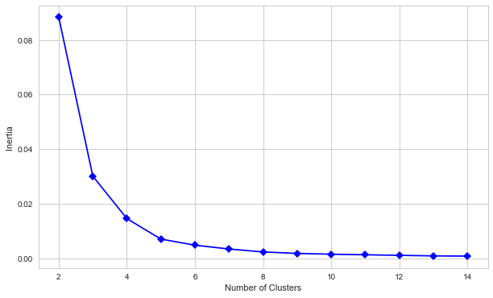
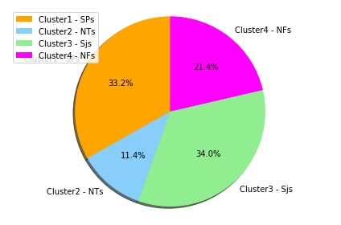

While doing Customer segmentation and Recommendation below steps has been followed.

1.  **Extrapolatory Data Analysis or EDA**
2.  **Data Preprocessing**
3.  **K-means clustering**
4.  **Customer Segmentation**
5.  **Recommendation**


The dataset has been uploaded in the dataframe named Supermarket

```python
import numpy as np
import pandas as pd
import matplotlib.pyplot as plt
from pandas import DataFrame,Series
%matplotlib inline

your_local_path = "C:/Users/SaikatPC/Desktop/attachment_ML_attachment_Project/Customer_Segmentation_Reco/"
Supermarket = pd.read_csv(your_local_path+'Supermarket_Purchase.csv')

Supermarket.head()
```

<table border="1" class="dataframe">
  <thead>
    <tr style="text-align: right;">
      <th></th>
      <th>Cust_id</th>
      <th>AVG_Actual_price_12</th>
      <th>Purchase_Value</th>
      <th>No_of_Items</th>
      <th>Total_Discount</th>
      <th>MONTH_SINCE_LAST_TRANSACTION</th>
    </tr>
  </thead>
  <tbody>
    <tr>
      <th>0</th>
      <td>1</td>
      <td>300.000000</td>
      <td>1200.00</td>
      <td>4</td>
      <td>0.00</td>
      <td>11</td>
    </tr>
    <tr>
      <th>1</th>
      <td>2</td>
      <td>2563.282500</td>
      <td>41012.52</td>
      <td>16</td>
      <td>78737.48</td>
      <td>2</td>
    </tr>
    <tr>
      <th>2</th>
      <td>4</td>
      <td>3510.000000</td>
      <td>7020.00</td>
      <td>2</td>
      <td>780.00</td>
      <td>4</td>
    </tr>
    <tr>
      <th>3</th>
      <td>8</td>
      <td>4530.000000</td>
      <td>13590.00</td>
      <td>3</td>
      <td>1510.00</td>
      <td>1</td>
    </tr>
    <tr>
      <th>4</th>
      <td>9</td>
      <td>2428.076923</td>
      <td>33455.00</td>
      <td>15</td>
      <td>17445.00</td>
      <td>6</td>
    </tr>
  </tbody>
</table>
</div>

# 1. EDA ( Extrapolatory Data Analysis ) #

After creating the dataset extrapolatory data analysis has been performed on the **Supermarket** dataset.

The dataset has total 702 rows and 6 columns
The columns are as follow : 

1.  **Cust_id**
2.  **AVG_Actual_price_12**
3.  **Purchase_Value** 
4.  **No_of_Items** 
5.  **Total_Discount** 
6.  **MONTH_SINCE_LAST_TRANSACTION**

Purchase value ranges from **302721.4 (max)** to **45.0 (min)**. Maximum number of items sold is **172** and minimum is **1**.

**21.65% ( highest )** of the total customers made a repetitive purchase in *1 month* and **2.85% ( lowest )** in *9 months*. 
This is concluded from the plot drawn below.

```python
from matplotlib.pyplot import show
import seaborn as sns
sns.set(style="darkgrid")
plt.figure(figsize=(10, 6))
total=Supermarket.shape[0]
ax = sns.countplot(x='MONTH_SINCE_LAST_TRANSACTION', data=Supermarket)
for p in ax.patches:
    height = p.get_height()
    ax.text((p.get_x() + p.get_width()/2),
           height + 2,
           '{:1.2f}'.format((height/total)*100),
            ha="center")
show()
```


Below observations can be drawn from the normal distribution of all the columns.

1.  **AVG_Actual_price_12** is *positively skewed*
2.  **Purchase_Value** is highly *positively skewed*
3.  **No_of_Items is highly** *positively skewed*
4.  **Total_Discount is highly** *positively skewed*
5.  **MONTH_SINCE_LAST_TRANSACTION** is *moderately positively skewed*.


```python
f,ax=plt.subplots(3,2,figsize=(12,18))
sns.distplot(Supermarket['AVG_Actual_price_12'],ax=ax[0,0])
ax[0,0].set_title('AVG_Actual_price_12 distribution')
sns.distplot(Supermarket['Purchase_Value'],ax=ax[0,1])
ax[0,1].set_title('Purchase_Value distribution')
sns.distplot(Supermarket['No_of_Items'],ax=ax[1,0])
ax[1,0].set_title('No_of_Items distribution')
sns.distplot(Supermarket['Total_Discount'],ax=ax[1,1])
ax[1,1].set_title('Total_Discount distribution')
sns.distplot(Supermarket['MONTH_SINCE_LAST_TRANSACTION'],ax=ax[2,0])
ax[2,0].set_title('MONTH_SINCE_LAST_TRANSACTION distribution')
```


Below conclusions can be drawn from the **pairplot** : 

1.  **Purchase_Value** and **No_of_Items** are *positively correlated*
2.  **Purchase_Value** and **Total_Discount** are *positively correlated*
3.  **Total_Discount** and **No_of_Items** are *positively correlated*


```python
import seaborn as sns
sns.pairplot(Supermarket)
```


**Heat map** clearly depicts some strong positive and negative correlations among several predictors. 

Positive Correlations :

1.  **Purchase_Value** and **No_of_items** are highly positively correlated *( corr -> 0.89)*
2.  **No_of_items** and **Total_Discount** are highly positively correlated *( corr -> 0.82)*
3.  **Total_Discount** and **Purchase_Value** are positively correlated *( corr -> 0.74)*
4.  **AVG_Actual_price_12** is slightly positively correlated  with **Purchase_Value** *(corr -> 0.019)*


Negative Correlations:

1.  **MONTH_SINCE_LAST_TRANSACTION** is lowly negatively correlated with **Total_Discount** *(corr->-0.23)*, **No_of_items** *(corr->-0.29)*
2.  **Purchase_Value** *(corr->-0.31)*, and **AVG_Actual_price_12** *(corr->-0.064)*
3.  **AVG_Actual_price_12** is lowly negatively correlated with **No_of_items** *(corr->-0.2)* and **Total_Discount** *(corr->-0.18)*


```python
corr=Supermarket.corr()
plt.figure(figsize=(12, 8))

sns.heatmap(corr, 
     vmax=.8, 
      linewidths=0.01,
         square=True,
         annot=True,
         cmap='Blues',
         linecolor="lightblue")
plt.title('Correlation between features');
```


# 2. Data Preprocessing #

In data preprocessing stage, we will normalize the data using min max scaler function.

```python
from sklearn.preprocessing import MinMaxScaler
from sklearn.preprocessing import Normalizer
scld = Normalizer()
Super_scld = scld.fit_transform(Supermarket)
Supermarket_Norm = pd.DataFrame(Super_scld, columns=Supermarket.columns)
Supermarket_Norm.columns =['Cust_id_Norm','AVG_Actual_price_12_Norm','Purchase_Value_Norm','No_of_Items_Norm','Total_Discount_Norm','MONTH_SINCE_LAST_TRANSACTION_Norm']

Supermarket_Norm.head()
```

<table border="1" class="dataframe">
  <thead>
    <tr style="text-align: right;">
      <th></th>
      <th>Cust_id_Norm</th>
      <th>AVG_Actual_price_12_Norm</th>
      <th>Purchase_Value_Norm</th>
      <th>No_of_Items_Norm</th>
      <th>Total_Discount_Norm</th>
      <th>MONTH_SINCE_LAST_TRANSACTION_Norm</th>
    </tr>
  </thead>
  <tbody>
    <tr>
      <th>0</th>
      <td>0.000808</td>
      <td>0.242525</td>
      <td>0.970099</td>
      <td>0.003234</td>
      <td>0.000000</td>
      <td>0.008893</td>
    </tr>
    <tr>
      <th>1</th>
      <td>0.000023</td>
      <td>0.028861</td>
      <td>0.461772</td>
      <td>0.000180</td>
      <td>0.886529</td>
      <td>0.000023</td>
    </tr>
    <tr>
      <th>2</th>
      <td>0.000507</td>
      <td>0.445021</td>
      <td>0.890042</td>
      <td>0.000254</td>
      <td>0.098894</td>
      <td>0.000507</td>
    </tr>
    <tr>
      <th>3</th>
      <td>0.000555</td>
      <td>0.314485</td>
      <td>0.943456</td>
      <td>0.000208</td>
      <td>0.104828</td>
      <td>0.000069</td>
    </tr>
    <tr>
      <th>4</th>
      <td>0.000238</td>
      <td>0.064221</td>
      <td>0.884861</td>
      <td>0.000397</td>
      <td>0.461408</td>
      <td>0.000159</td>
    </tr>
  </tbody>
</table>
</div>


An array has been created by choosing column **AVG_Actual_price_12_Norm** and **MONTH_SINCE_LAST_TRANSACTION_Norm** from *Supermarket_head* dataframe.

```python
X = Supermarket_Norm.iloc[:,[1,5]].values
X

    array([[2.42524688e-01, 8.89257189e-03],
           [2.88607651e-02, 2.25185988e-05],
           [4.45021230e-01, 5.07146701e-04],
           ...,
           [2.46790487e-01, 8.53343469e-03],
           [5.70559718e-01, 1.82579110e-03],
           [5.71776798e-01, 1.65333050e-03]])
```
A dataframe has been created using two columns named **number of clusters** (starting from 2 to 15) and also **inertia**. 

```python
from sklearn.cluster import KMeans
num_of_clusters = range(2,15)
error=[]

for num_clusters in num_of_clusters:
    clusters = KMeans(num_clusters)
    clusters.fit(X)
    error.append(clusters.inertia_/100)

df = pd.DataFrame({"Cluster_Numbers":num_of_clusters, "Error_Term":error})
df
```
<table border="1" class="dataframe">
  <thead>
    <tr style="text-align: right;">
      <th></th>
      <th>Cluster_Numbers</th>
      <th>Error_Term</th>
    </tr>
  </thead>
  <tbody>
    <tr>
      <th>0</th>
      <td>2</td>
      <td>0.088315</td>
    </tr>
    <tr>
      <th>1</th>
      <td>3</td>
      <td>0.030073</td>
    </tr>
    <tr>
      <th>2</th>
      <td>4</td>
      <td>0.014520</td>
    </tr>
    <tr>
      <th>3</th>
      <td>5</td>
      <td>0.006992</td>
    </tr>
    <tr>
      <th>4</th>
      <td>6</td>
      <td>0.004769</td>
    </tr>
    <tr>
      <th>5</th>
      <td>7</td>
      <td>0.003358</td>
    </tr>
    <tr>
      <th>6</th>
      <td>8</td>
      <td>0.002288</td>
    </tr>
    <tr>
      <th>7</th>
      <td>9</td>
      <td>0.001750</td>
    </tr>
    <tr>
      <th>8</th>
      <td>10</td>
      <td>0.001456</td>
    </tr>
    <tr>
      <th>9</th>
      <td>11</td>
      <td>0.001242</td>
    </tr>
    <tr>
      <th>10</th>
      <td>12</td>
      <td>0.001044</td>
    </tr>
    <tr>
      <th>11</th>
      <td>13</td>
      <td>0.000840</td>
    </tr>
    <tr>
      <th>12</th>
      <td>14</td>
      <td>0.000761</td>
    </tr>
  </tbody>
</table>
</div>

Using below python script **the optimum number of clusters** has been calculated using elbow curve. 
Clearly, the elbow was at **cluster number 3**.

```python
import matplotlib.pyplot as plt
%matplotlib inline
plt.figure(figsize=(10,6))
plt.plot(df.Cluster_Numbers, df.Error_Term, marker = "D", color='blue')
plt.xlabel('Number of Clusters')
plt.ylabel('Inertia')
plt.show()
```




# 3. K-means Clustering # 

After finding the elbow point (**at cluser number: 3**) *kmeans* has been calculated.

```python
kmeans =KMeans(n_clusters = 3, init = 'k-means++', max_iter = 300, n_init = 10, random_state = 0)
y_kmeans = kmeans.fit_predict(X)
```
A new column named **Cluster** has been added at the end of the cluster **Supermarket_Norm**. 

```python
Supermarket_Norm['Cluster'] = y_kmeans
Supermarket_Norm.head(10)
```
<table border="1" class="dataframe">
  <thead>
    <tr style="text-align: right;">
      <th></th>
      <th>Cust_id_Norm</th>
      <th>AVG_Actual_price_12_Norm</th>
      <th>Purchase_Value_Norm</th>
      <th>No_of_Items_Norm</th>
      <th>Total_Discount_Norm</th>
      <th>MONTH_SINCE_LAST_TRANSACTION_Norm</th>
      <th>Cluster</th>
    </tr>
  </thead>
  <tbody>
    <tr>
      <th>0</th>
      <td>0.000808</td>
      <td>0.242525</td>
      <td>0.970099</td>
      <td>0.003234</td>
      <td>0.000000</td>
      <td>0.008893</td>
      <td>0</td>
    </tr>
    <tr>
      <th>1</th>
      <td>0.000023</td>
      <td>0.028861</td>
      <td>0.461772</td>
      <td>0.000180</td>
      <td>0.886529</td>
      <td>0.000023</td>
      <td>1</td>
    </tr>
    <tr>
      <th>2</th>
      <td>0.000507</td>
      <td>0.445021</td>
      <td>0.890042</td>
      <td>0.000254</td>
      <td>0.098894</td>
      <td>0.000507</td>
      <td>0</td>
    </tr>
    <tr>
      <th>3</th>
      <td>0.000555</td>
      <td>0.314485</td>
      <td>0.943456</td>
      <td>0.000208</td>
      <td>0.104828</td>
      <td>0.000069</td>
      <td>0</td>
    </tr>
    <tr>
      <th>4</th>
      <td>0.000238</td>
      <td>0.064221</td>
      <td>0.884861</td>
      <td>0.000397</td>
      <td>0.461408</td>
      <td>0.000159</td>
      <td>1</td>
    </tr>
    <tr>
      <th>5</th>
      <td>0.000389</td>
      <td>0.028954</td>
      <td>0.347454</td>
      <td>0.000467</td>
      <td>0.937250</td>
      <td>0.000273</td>
      <td>1</td>
    </tr>
    <tr>
      <th>6</th>
      <td>0.000431</td>
      <td>0.064623</td>
      <td>0.578777</td>
      <td>0.000744</td>
      <td>0.812921</td>
      <td>0.000039</td>
      <td>1</td>
    </tr>
    <tr>
      <th>7</th>
      <td>0.000297</td>
      <td>0.055947</td>
      <td>0.923355</td>
      <td>0.000421</td>
      <td>0.379848</td>
      <td>0.000074</td>
      <td>1</td>
    </tr>
    <tr>
      <th>8</th>
      <td>0.001913</td>
      <td>0.069534</td>
      <td>0.278135</td>
      <td>0.000589</td>
      <td>0.958020</td>
      <td>0.000147</td>
      <td>1</td>
    </tr>
    <tr>
      <th>9</th>
      <td>0.001559</td>
      <td>0.311785</td>
      <td>0.935355</td>
      <td>0.000334</td>
      <td>0.167028</td>
      <td>0.001002</td>
      <td>0</td>
    </tr>
  </tbody>
</table>
</div>

Dataframe **df_3_Norm** contains **Cluster_Numbers**, **Cust_id**, **Number_Of_Customer**, and **Percentage_Of_Customer**. The same dataframe tells which customer(**Cust_id**) belongs to which **Cluster_Numbers**

```python
from sklearn.cluster import KMeans
num_of_clusters = range(0,3)
numofcluster = []
Customer_id=[]
Number_of_cust=[]
Percentage=[]

for x in num_of_clusters:
    
    Customer_id.append(Supermarket_Norm[Supermarket_Norm['Cluster'] == x].index.get_values())
    Number_of_cust.append(len((Supermarket_Norm[Supermarket_Norm['Cluster'] == x].get_values())))
    Percentage.append(len((Supermarket_Norm[Supermarket_Norm['Cluster'] == x].get_values()))/len(Supermarket_Norm)*100)
    numofcluster.append(x+1)

df_3_Norm = pd.DataFrame({"Cluster_Numbers":numofcluster, "Cust_id":Customer_id, "Number_Of_Customer":Number_of_cust, "Percentage_Of_Customer":Percentage})
df_3_Norm
```

<table border="1" class="dataframe">
  <thead>
    <tr style="text-align: right;">
      <th></th>
      <th>Cluster_Numbers</th>
      <th>Cust_id</th>
      <th>Number_Of_Customer</th>
      <th>Percentage_Of_Customer</th>
    </tr>
  </thead>
  <tbody>
    <tr>
      <th>0</th>
      <td>1</td>
      <td>[0, 2, 3, 9, 25, 33, 37, 40, 42, 43, 44, 45, 4...</td>
      <td>199</td>
      <td>28.347578</td>
    </tr>
    <tr>
      <th>1</th>
      <td>2</td>
      <td>[1, 4, 5, 6, 7, 8, 11, 12, 13, 15, 16, 17, 19,...</td>
      <td>377</td>
      <td>53.703704</td>
    </tr>
    <tr>
      <th>2</th>
      <td>3</td>
      <td>[10, 14, 18, 29, 30, 31, 34, 35, 38, 62, 64, 6...</td>
      <td>126</td>
      <td>17.948718</td>
    </tr>
  </tbody>
</table>
</div>


```python
Supermarket['Cluster'] = y_kmeans
Supermarket.head(10)
```
<table border="1" class="dataframe">
  <thead>
    <tr style="text-align: right;">
      <th></th>
      <th>Cust_id</th>
      <th>AVG_Actual_price_12</th>
      <th>Purchase_Value</th>
      <th>No_of_Items</th>
      <th>Total_Discount</th>
      <th>MONTH_SINCE_LAST_TRANSACTION</th>
      <th>Cluster</th>
    </tr>
  </thead>
  <tbody>
    <tr>
      <th>0</th>
      <td>1</td>
      <td>300.000000</td>
      <td>1200.00</td>
      <td>4</td>
      <td>0.00</td>
      <td>11</td>
      <td>0</td>
    </tr>
    <tr>
      <th>1</th>
      <td>2</td>
      <td>2563.282500</td>
      <td>41012.52</td>
      <td>16</td>
      <td>78737.48</td>
      <td>2</td>
      <td>1</td>
    </tr>
    <tr>
      <th>2</th>
      <td>4</td>
      <td>3510.000000</td>
      <td>7020.00</td>
      <td>2</td>
      <td>780.00</td>
      <td>4</td>
      <td>0</td>
    </tr>
    <tr>
      <th>3</th>
      <td>8</td>
      <td>4530.000000</td>
      <td>13590.00</td>
      <td>3</td>
      <td>1510.00</td>
      <td>1</td>
      <td>0</td>
    </tr>
    <tr>
      <th>4</th>
      <td>9</td>
      <td>2428.076923</td>
      <td>33455.00</td>
      <td>15</td>
      <td>17445.00</td>
      <td>6</td>
      <td>1</td>
    </tr>
    <tr>
      <th>5</th>
      <td>10</td>
      <td>743.750000</td>
      <td>8925.00</td>
      <td>12</td>
      <td>24075.00</td>
      <td>7</td>
      <td>1</td>
    </tr>
    <tr>
      <th>6</th>
      <td>11</td>
      <td>1649.357143</td>
      <td>14772.00</td>
      <td>19</td>
      <td>20748.00</td>
      <td>1</td>
      <td>1</td>
    </tr>
    <tr>
      <th>7</th>
      <td>12</td>
      <td>2257.916667</td>
      <td>37265.00</td>
      <td>17</td>
      <td>15330.00</td>
      <td>3</td>
      <td>1</td>
    </tr>
    <tr>
      <th>8</th>
      <td>13</td>
      <td>472.500000</td>
      <td>1890.00</td>
      <td>4</td>
      <td>6510.00</td>
      <td>1</td>
      <td>1</td>
    </tr>
    <tr>
      <th>9</th>
      <td>14</td>
      <td>2800.000000</td>
      <td>8400.00</td>
      <td>3</td>
      <td>1500.00</td>
      <td>9</td>
      <td>0</td>
    </tr>
  </tbody>
</table>
</div>


```python
from sklearn.cluster import KMeans
num_of_clusters = range(0,3)
numofcluster = []
Customer_id=[]
Number_of_cust=[]
Percentage=[]

for x in num_of_clusters:
    
    Customer_id.append(Supermarket[Supermarket['Cluster'] == x].index.get_values())
    Number_of_cust.append(len((Supermarket[Supermarket['Cluster'] == x].get_values())))
    Percentage.append(len((Supermarket[Supermarket['Cluster'] == x].get_values()))/len(Supermarket)*100)
    numofcluster.append(x+1)

df_3 = pd.DataFrame({"Cluster_Numbers":numofcluster, "Cust_id":Customer_id, "Number_Of_Customer":Number_of_cust, "Percentage_Of_Customer":Percentage})
df_3
```

<table border="1" class="dataframe">
  <thead>
    <tr style="text-align: right;">
      <th></th>
      <th>Cluster_Numbers</th>
      <th>Cust_id</th>
      <th>Number_Of_Customer</th>
      <th>Percentage_Of_Customer</th>
    </tr>
  </thead>
  <tbody>
    <tr>
      <th>0</th>
      <td>1</td>
      <td>[0, 2, 3, 9, 25, 33, 37, 40, 42, 43, 44, 45, 4...</td>
      <td>199</td>
      <td>28.347578</td>
    </tr>
    <tr>
      <th>1</th>
      <td>2</td>
      <td>[1, 4, 5, 6, 7, 8, 11, 12, 13, 15, 16, 17, 19,...</td>
      <td>377</td>
      <td>53.703704</td>
    </tr>
    <tr>
      <th>2</th>
      <td>3</td>
      <td>[10, 14, 18, 29, 30, 31, 34, 35, 38, 62, 64, 6...</td>
      <td>126</td>
      <td>17.948718</td>
    </tr>
  </tbody>
</table>
</div>

If we will compare dataframe **df_3_Norm** and **df_3**, we will see that both the dataframe contain same ***columns and data.***
Hence forth, we can add **Cluster** column at the end of the dataframe **Supermarket** and it wont make any difference while analyzing normalized version (**Supermarket_Norm**) or normal dataframe **Supermarket**.


Creating **cluster profile** and analyzing the same always helps in extracting important information. 
Dataframe **clust_profile** will also help us in giving some perspective about the clusters.

```python
clust_profile = pd.pivot_table(Supermarket, values=['AVG_Actual_price_12','Purchase_Value','No_of_Items','MONTH_SINCE_LAST_TRANSACTION'], index='Cluster',aggfunc=np.mean)
clust_profile
```
<table border="1" class="dataframe">
  <thead>
    <tr style="text-align: right;">
      <th></th>
      <th>AVG_Actual_price_12</th>
      <th>MONTH_SINCE_LAST_TRANSACTION</th>
      <th>No_of_Items</th>
      <th>Purchase_Value</th>
    </tr>
    <tr>
      <th>Cluster</th>
      <th></th>
      <th></th>
      <th></th>
      <th></th>
    </tr>
  </thead>
  <tbody>
    <tr>
      <th>0</th>
      <td>3097.811420</td>
      <td>5.804020</td>
      <td>2.492462</td>
      <td>7761.558291</td>
    </tr>
    <tr>
      <th>1</th>
      <td>2007.867150</td>
      <td>4.124668</td>
      <td>18.310345</td>
      <td>31522.585066</td>
    </tr>
    <tr>
      <th>2</th>
      <td>3824.364365</td>
      <td>6.515873</td>
      <td>1.007937</td>
      <td>3853.332619</td>
    </tr>
  </tbody>
</table>
</div>

**Cluster 0** is made up with **Average Spenders**, **Cluster 1** is no doubt a group **Tightwads**, and **CLuster 2** is a group made up with those people who believe in shooping lavishly and which is why this group of people are known as **Spendthrifts** 


```python
Supermarket_Norm['MONTH_SINCE_LAST_TRANSACTION_Norm'].max(), Supermarket_Norm['AVG_Actual_price_12_Norm'].max()
    (0.01975289072831315, 0.7071021489611119)

Supermarket_Norm['MONTH_SINCE_LAST_TRANSACTION_Norm'].min(), Supermarket_Norm['AVG_Actual_price_12_Norm'].min()
    (1.7090633720824546e-06, 0.002239716999065861)
```

Below plot is of **AVG_Actual_price_12_Norm** and **MONTH_SINCE_LAST_TRANSACTION_Norm** which help us in shedding some light on the customer  distribution among different **clusters**

```python
# Visualizing the clusters
plt.figure(figsize=(10,6))
plt.scatter(X[y_kmeans == 0,0],X[y_kmeans == 0,1], s = 50, c='blue',label='Cluster1 - Average Spenders')
plt.scatter(X[y_kmeans == 1,0],X[y_kmeans == 1,1], s = 50, c='red',label='Cluster2 - Tightwads')
plt.scatter(X[y_kmeans == 2,0],X[y_kmeans == 2,1], s = 50, c='green',label='Cluster3 - Spendthrifts')
plt.scatter(kmeans.cluster_centers_[:,0], kmeans.cluster_centers_[:,1], s=200, c='magenta', label='Centroids',marker='*')
plt.title('Cluster of Clients')
plt.xlabel('AVG_Actual_price_12_Norm')
plt.ylabel('MONTH_SINCE_LAST_TRANSACTION_Norm')
plt.legend()
plt.show()
```


```python
from sklearn.cluster import KMeans
k_means = KMeans(n_clusters=3, init='k-means++', random_state=5000)
k_means.fit(Supermarket[['MONTH_SINCE_LAST_TRANSACTION','AVG_Actual_price_12']])
fig = plt.figure(figsize=(10,6))
plt.scatter(Supermarket['MONTH_SINCE_LAST_TRANSACTION'],Supermarket['AVG_Actual_price_12'],50,c=k_means.labels_, alpha=0.8)
plt.xlabel('MONTH_SINCE_LAST_TRANSACTION')
plt.ylabel('AVG_Actual_price_12')
plt.legend()
#[plt.text(row.MONTH_SINCE_LAST_TRANSACTION, row.AVG_Actual_price_12, row.Cust_id)]
#[plt.text(row.MONTH_SINCE_LAST_TRANSACTION, row.AVG_Actual_price_12, row.Cust_id) for row in Supermarket.intertuples()]
plt.show()
```


A pie-chart has been plotted in order to provide a pictorial representation of the segmented customers in 3 different categories i.e.

1.  **Tightwads**
2.  **Average Spenders**
3.  **Spendthrifts**


```python
import matplotlib.pyplot as plt

labels = ['Cluster1 - Spendthrifts','Cluster2 - Tightwads','Cluster3 - Average Spenders']
sizes = [199,377,126]
colors = ['lightskyblue','orange','lightgreen']
patches, texts = plt.pie(sizes, colors=colors, shadow=True, startangle=90)
plt.legend(patches, labels, loc='upper left')

plt.pie(sizes, labels=labels, colors=colors, autopct='%1.1f%%', shadow=True, startangle=90, radius = 1000)
plt.axis('equal')
plt.tight_layout()
plt.show()
```


####################################################################################################################################
A new predictor called **Selling_Price_Peritem** has been made combining **Purchase_Value** , **No_of_Items** , and **Total_Discount** 

```python
Supermarket['Selling_Price_Peritem'] = (Supermarket['Purchase_Value'] + Supermarket['Total_Discount']) / Supermarket['No_of_Items']
Supermarket.head()
```

<table border="1" class="dataframe">
  <thead>
    <tr style="text-align: right;">
      <th></th>
      <th>Cust_id</th>
      <th>AVG_Actual_price_12</th>
      <th>Purchase_Value</th>
      <th>No_of_Items</th>
      <th>Total_Discount</th>
      <th>MONTH_SINCE_LAST_TRANSACTION</th>
      <th>Selling_Price_Peritem</th>
    </tr>
  </thead>
  <tbody>
    <tr>
      <th>0</th>
      <td>1</td>
      <td>300.000000</td>
      <td>1200.00</td>
      <td>4</td>
      <td>0.00</td>
      <td>11</td>
      <td>300.000000</td>
    </tr>
    <tr>
      <th>1</th>
      <td>2</td>
      <td>2563.282500</td>
      <td>41012.52</td>
      <td>16</td>
      <td>78737.48</td>
      <td>2</td>
      <td>7484.375000</td>
    </tr>
    <tr>
      <th>2</th>
      <td>4</td>
      <td>3510.000000</td>
      <td>7020.00</td>
      <td>2</td>
      <td>780.00</td>
      <td>4</td>
      <td>3900.000000</td>
    </tr>
    <tr>
      <th>3</th>
      <td>8</td>
      <td>4530.000000</td>
      <td>13590.00</td>
      <td>3</td>
      <td>1510.00</td>
      <td>1</td>
      <td>5033.333333</td>
    </tr>
    <tr>
      <th>4</th>
      <td>9</td>
      <td>2428.076923</td>
      <td>33455.00</td>
      <td>15</td>
      <td>17445.00</td>
      <td>6</td>
      <td>3393.333333</td>
    </tr>
  </tbody>
</table>
</div>

X has the values of the columns **Selling_Price_Peritem** and **MONTH_SINCE_LAST_TRANSACTION**

```python
X = Supermarket.iloc[:,[5,6]].values
X
    array([[1.100000e+01, 3.000000e+02],
           [2.000000e+00, 7.484375e+03],
           [4.000000e+00, 3.900000e+03],
           ...,
           [1.200000e+01, 6.500000e+02],
           [1.200000e+01, 7.500000e+03],
           [1.200000e+01, 8.300000e+03]])
```
A new dataframe has been created with a view to find out the elbow of the elbow curve. The values of the intertia of different number of clusters have been put inside an array called error and then the elbow curve is plot.

df is the dataframe that has the columns with the decreasing value of inertia along with the increasing number of clusters. The motive is to find out the elbow point of the elbow curve.

```python
from sklearn.cluster import KMeans
num_of_clusters = range(2,15)
error=[]

for num_clusters in num_of_clusters:
    clusters = KMeans(num_clusters)
    clusters.fit(X)
    error.append(clusters.inertia_/100)

df = pd.DataFrame({"Cluster_Numbers":num_of_clusters, "Error_Term":error})
df
```

<table border="1" class="dataframe">
  <thead>
    <tr style="text-align: right;">
      <th></th>
      <th>Cluster_Numbers</th>
      <th>Error_Term</th>
    </tr>
  </thead>
  <tbody>
    <tr>
      <th>0</th>
      <td>2</td>
      <td>1.219776e+07</td>
    </tr>
    <tr>
      <th>1</th>
      <td>3</td>
      <td>6.394629e+06</td>
    </tr>
    <tr>
      <th>2</th>
      <td>4</td>
      <td>3.858976e+06</td>
    </tr>
    <tr>
      <th>3</th>
      <td>5</td>
      <td>2.762326e+06</td>
    </tr>
    <tr>
      <th>4</th>
      <td>6</td>
      <td>1.814520e+06</td>
    </tr>
    <tr>
      <th>5</th>
      <td>7</td>
      <td>1.249465e+06</td>
    </tr>
    <tr>
      <th>6</th>
      <td>8</td>
      <td>1.022786e+06</td>
    </tr>
    <tr>
      <th>7</th>
      <td>9</td>
      <td>7.900221e+05</td>
    </tr>
    <tr>
      <th>8</th>
      <td>10</td>
      <td>6.399092e+05</td>
    </tr>
    <tr>
      <th>9</th>
      <td>11</td>
      <td>5.400044e+05</td>
    </tr>
    <tr>
      <th>10</th>
      <td>12</td>
      <td>4.340357e+05</td>
    </tr>
    <tr>
      <th>11</th>
      <td>13</td>
      <td>3.451056e+05</td>
    </tr>
    <tr>
      <th>12</th>
      <td>14</td>
      <td>2.913966e+05</td>
    </tr>
  </tbody>
</table>
</div>

Below is the plot between Number of Clusters and Inertia. From the below curve it is quite evident that when you will have 4 clsuters the inertia term will drop significantly. So we will create 4 clusters and would try to plot the corresponding Cust_id in the graph.

```python
#Find the right number of clusters
import matplotlib.pyplot as plt
%matplotlib inline
plt.figure(figsize=(10,6))
plt.plot(df.Cluster_Numbers, df.Error_Term, marker = "D", color='blue')
plt.xlabel('Number of Clusters')
plt.ylabel('Inertia')
plt.show()
```


Below is the array of the predicted output of y_kmean after creating K means cluster of 3 clusters

```python
kmeans =KMeans(n_clusters = 4, init = 'k-means++', max_iter = 300, n_init = 10, random_state = 0)
y_kmeans = kmeans.fit_predict(X)
y_kmeans

    array([2, 1, 0, 3, 0, 0, 2, 0, 2, 0, 0, 3, 0, 3, 1, 1, 0, 0, 2, 0, 2, 0,
           2, 2, 0, 0, 3, 0, 2, 0, 2, 1, 3, 3, 3, 2, 0, 2, 2, 3, 3, 0, 0, 2,
           2, 2, 3, 3, 0, 0, 3, 3, 2, 0, 3, 3, 0, 0, 0, 3, 0, 3, 3, 3, 3, 2,
           0, 0, 0, 2, 2, 0, 0, 2, 2, 1, 0, 3, 0, 3, 2, 2, 1, 3, 1, 3, 2, 0,
           0, 0, 0, 0, 0, 2, 1, 3, 2, 1, 2, 2, 2, 2, 3, 0, 2, 3, 0, 0, 3, 3,
           2, 3, 0, 1, 1, 2, 0, 0, 0, 3, 0, 2, 0, 0, 3, 2, 0, 0, 0, 3, 2, 3,
           2, 0, 3, 2, 2, 3, 2, 2, 0, 2, 2, 1, 3, 0, 2, 2, 2, 3, 0, 2, 0, 0,
           2, 2, 2, 0, 2, 3, 2, 2, 2, 0, 1, 2, 0, 3, 3, 0, 2, 0, 3, 1, 0, 2,
           2, 0, 0, 2, 1, 0, 3, 0, 0, 3, 1, 0, 3, 1, 3, 2, 2, 3, 3, 2, 3, 2,
           2, 2, 2, 2, 0, 0, 2, 2, 3, 2, 2, 0, 0, 0, 0, 2, 0, 1, 1, 0, 3, 2,
           2, 2, 2, 3, 0, 3, 0, 2, 0, 3, 2, 2, 3, 1, 1, 1, 3, 0, 0, 0, 0, 1,
           2, 2, 2, 2, 2, 3, 2, 3, 0, 3, 3, 0, 2, 3, 2, 1, 2, 1, 0, 0, 2, 3,
           2, 0, 0, 2, 0, 2, 0, 3, 2, 2, 0, 1, 3, 2, 0, 2, 1, 0, 2, 3, 3, 3,
           2, 0, 0, 0, 3, 3, 0, 3, 0, 0, 2, 2, 2, 2, 3, 0, 0, 3, 3, 1, 2, 2,
           2, 2, 3, 0, 0, 0, 0, 0, 2, 2, 3, 2, 1, 2, 2, 1, 2, 3, 1, 0, 0, 2,
           0, 0, 0, 1, 1, 2, 0, 2, 0, 2, 0, 1, 0, 3, 0, 2, 3, 2, 2, 1, 3, 0,
           0, 0, 1, 1, 0, 2, 2, 2, 3, 2, 0, 3, 0, 2, 0, 2, 0, 3, 1, 2, 2, 2,
           3, 2, 0, 2, 2, 3, 0, 2, 0, 3, 3, 2, 2, 1, 2, 0, 3, 3, 2, 3, 1, 0,
           2, 2, 2, 2, 0, 2, 2, 2, 3, 2, 2, 3, 2, 0, 2, 1, 2, 0, 3, 0, 2, 2,
           0, 0, 2, 1, 2, 0, 0, 0, 1, 0, 1, 0, 0, 3, 0, 0, 1, 0, 2, 2, 2, 0,
           2, 0, 2, 3, 0, 3, 2, 0, 0, 2, 2, 0, 3, 2, 1, 0, 2, 2, 1, 0, 0, 3,
           3, 0, 3, 1, 2, 2, 2, 3, 2, 2, 2, 1, 3, 0, 3, 0, 2, 0, 1, 0, 3, 2,
           0, 2, 3, 0, 2, 1, 2, 2, 3, 3, 0, 3, 0, 3, 3, 3, 2, 2, 3, 3, 3, 1,
           2, 2, 3, 3, 3, 2, 2, 0, 1, 0, 2, 0, 2, 1, 3, 1, 1, 3, 1, 1, 0, 0,
           2, 2, 1, 0, 0, 1, 0, 0, 1, 2, 3, 0, 3, 2, 2, 2, 2, 2, 0, 2, 0, 3,
           0, 2, 0, 3, 0, 2, 2, 0, 3, 0, 0, 1, 0, 1, 2, 0, 3, 2, 1, 2, 2, 2,
           2, 0, 0, 3, 1, 2, 3, 0, 2, 3, 0, 2, 3, 1, 3, 2, 3, 0, 0, 0, 3, 0,
           3, 3, 2, 2, 2, 2, 0, 2, 2, 3, 0, 1, 2, 0, 0, 0, 2, 1, 1, 0, 3, 0,
           2, 2, 0, 1, 2, 0, 0, 3, 2, 0, 3, 1, 1, 0, 0, 0, 0, 0, 2, 2, 0, 2,
           2, 0, 3, 0, 3, 2, 2, 0, 0, 2, 0, 0, 2, 0, 2, 0, 0, 0, 1, 1, 3, 2,
           0, 0, 0, 2, 0, 3, 2, 0, 0, 3, 0, 1, 2, 2, 3, 0, 3, 2, 0, 0, 1, 2,
           2, 0, 0, 1, 2, 3, 0, 3, 3, 1, 3, 0, 3, 2, 2, 3, 2, 2, 1, 1])

```
A new column called "Clusters" been appended and mapped in Supermarket dataframe.

```python
Supermarket['Cluster'] = y_kmeans
Supermarket.head(10)
```
<table border="1" class="dataframe">
  <thead>
    <tr style="text-align: right;">
      <th></th>
      <th>Cust_id</th>
      <th>AVG_Actual_price_12</th>
      <th>Purchase_Value</th>
      <th>No_of_Items</th>
      <th>Total_Discount</th>
      <th>MONTH_SINCE_LAST_TRANSACTION</th>
      <th>Selling_Price_Peritem</th>
      <th>Cluster</th>
    </tr>
  </thead>
  <tbody>
    <tr>
      <th>0</th>
      <td>1</td>
      <td>300.000000</td>
      <td>1200.00</td>
      <td>4</td>
      <td>0.00</td>
      <td>11</td>
      <td>300.000000</td>
      <td>2</td>
    </tr>
    <tr>
      <th>1</th>
      <td>2</td>
      <td>2563.282500</td>
      <td>41012.52</td>
      <td>16</td>
      <td>78737.48</td>
      <td>2</td>
      <td>7484.375000</td>
      <td>1</td>
    </tr>
    <tr>
      <th>2</th>
      <td>4</td>
      <td>3510.000000</td>
      <td>7020.00</td>
      <td>2</td>
      <td>780.00</td>
      <td>4</td>
      <td>3900.000000</td>
      <td>0</td>
    </tr>
    <tr>
      <th>3</th>
      <td>8</td>
      <td>4530.000000</td>
      <td>13590.00</td>
      <td>3</td>
      <td>1510.00</td>
      <td>1</td>
      <td>5033.333333</td>
      <td>3</td>
    </tr>
    <tr>
      <th>4</th>
      <td>9</td>
      <td>2428.076923</td>
      <td>33455.00</td>
      <td>15</td>
      <td>17445.00</td>
      <td>6</td>
      <td>3393.333333</td>
      <td>0</td>
    </tr>
    <tr>
      <th>5</th>
      <td>10</td>
      <td>743.750000</td>
      <td>8925.00</td>
      <td>12</td>
      <td>24075.00</td>
      <td>7</td>
      <td>2750.000000</td>
      <td>0</td>
    </tr>
    <tr>
      <th>6</th>
      <td>11</td>
      <td>1649.357143</td>
      <td>14772.00</td>
      <td>19</td>
      <td>20748.00</td>
      <td>1</td>
      <td>1869.473684</td>
      <td>2</td>
    </tr>
    <tr>
      <th>7</th>
      <td>12</td>
      <td>2257.916667</td>
      <td>37265.00</td>
      <td>17</td>
      <td>15330.00</td>
      <td>3</td>
      <td>3093.823529</td>
      <td>0</td>
    </tr>
    <tr>
      <th>8</th>
      <td>13</td>
      <td>472.500000</td>
      <td>1890.00</td>
      <td>4</td>
      <td>6510.00</td>
      <td>1</td>
      <td>2100.000000</td>
      <td>2</td>
    </tr>
    <tr>
      <th>9</th>
      <td>14</td>
      <td>2800.000000</td>
      <td>8400.00</td>
      <td>3</td>
      <td>1500.00</td>
      <td>9</td>
      <td>3300.000000</td>
      <td>0</td>
    </tr>
  </tbody>
</table>
</div>

Column **Cust_id** has been set as Index of Supermarket dataframe.

```python
Supermarket.set_index('Cust_id',inplace=True)
Supermarket.head(10)
```

<table border="1" class="dataframe">
  <thead>
    <tr style="text-align: right;">
      <th></th>
      <th>AVG_Actual_price_12</th>
      <th>Purchase_Value</th>
      <th>No_of_Items</th>
      <th>Total_Discount</th>
      <th>MONTH_SINCE_LAST_TRANSACTION</th>
      <th>Selling_Price_Peritem</th>
      <th>Cluster</th>
    </tr>
    <tr>
      <th>Cust_id</th>
      <th></th>
      <th></th>
      <th></th>
      <th></th>
      <th></th>
      <th></th>
      <th></th>
    </tr>
  </thead>
  <tbody>
    <tr>
      <th>1</th>
      <td>300.000000</td>
      <td>1200.00</td>
      <td>4</td>
      <td>0.00</td>
      <td>11</td>
      <td>300.000000</td>
      <td>2</td>
    </tr>
    <tr>
      <th>2</th>
      <td>2563.282500</td>
      <td>41012.52</td>
      <td>16</td>
      <td>78737.48</td>
      <td>2</td>
      <td>7484.375000</td>
      <td>1</td>
    </tr>
    <tr>
      <th>4</th>
      <td>3510.000000</td>
      <td>7020.00</td>
      <td>2</td>
      <td>780.00</td>
      <td>4</td>
      <td>3900.000000</td>
      <td>0</td>
    </tr>
    <tr>
      <th>8</th>
      <td>4530.000000</td>
      <td>13590.00</td>
      <td>3</td>
      <td>1510.00</td>
      <td>1</td>
      <td>5033.333333</td>
      <td>3</td>
    </tr>
    <tr>
      <th>9</th>
      <td>2428.076923</td>
      <td>33455.00</td>
      <td>15</td>
      <td>17445.00</td>
      <td>6</td>
      <td>3393.333333</td>
      <td>0</td>
    </tr>
    <tr>
      <th>10</th>
      <td>743.750000</td>
      <td>8925.00</td>
      <td>12</td>
      <td>24075.00</td>
      <td>7</td>
      <td>2750.000000</td>
      <td>0</td>
    </tr>
    <tr>
      <th>11</th>
      <td>1649.357143</td>
      <td>14772.00</td>
      <td>19</td>
      <td>20748.00</td>
      <td>1</td>
      <td>1869.473684</td>
      <td>2</td>
    </tr>
    <tr>
      <th>12</th>
      <td>2257.916667</td>
      <td>37265.00</td>
      <td>17</td>
      <td>15330.00</td>
      <td>3</td>
      <td>3093.823529</td>
      <td>0</td>
    </tr>
    <tr>
      <th>13</th>
      <td>472.500000</td>
      <td>1890.00</td>
      <td>4</td>
      <td>6510.00</td>
      <td>1</td>
      <td>2100.000000</td>
      <td>2</td>
    </tr>
    <tr>
      <th>14</th>
      <td>2800.000000</td>
      <td>8400.00</td>
      <td>3</td>
      <td>1500.00</td>
      <td>9</td>
      <td>3300.000000</td>
      <td>0</td>
    </tr>
  </tbody>
</table>
</div>

The max and min of the two columns have been found to identify the x and y axis in the plot.

```python
Supermarket['Selling_Price_Peritem'].max(), Supermarket['MONTH_SINCE_LAST_TRANSACTION'].max()
    (18000.0, 12)
```

```python
Supermarket['Selling_Price_Peritem'].min(), Supermarket['MONTH_SINCE_LAST_TRANSACTION'].min()
    (50.0, 1)
```
A new datframe has been made consting of Cluster Number, Customer Id, Number of Customer in that cluster, and Percentrage of the Customer in that Cluster

```python
from sklearn.cluster import KMeans
num_of_clusters = range(0,4)
numofcluster = []
Customer_id=[]
Number_of_cust=[]
Percentage=[]

for x in num_of_clusters:
    
    Customer_id.append(Supermarket[Supermarket['Cluster'] == x].index.get_values())
    Number_of_cust.append(len((Supermarket[Supermarket['Cluster'] == x].get_values())))
    Percentage.append(len((Supermarket[Supermarket['Cluster'] == x].get_values()))/len(Supermarket)*100)
    numofcluster.append(x+1)

df_4 = pd.DataFrame({"Cluster_Numbers":numofcluster, "Cust_id":Customer_id, "Number_Of_Customer":Number_of_cust, "Percentage_Of_Customer":Percentage})
df_4
```
<table border="1" class="dataframe">
  <thead>
    <tr style="text-align: right;">
      <th></th>
      <th>Cluster_Numbers</th>
      <th>Cust_id</th>
      <th>Number_Of_Customer</th>
      <th>Percentage_Of_Customer</th>
    </tr>
  </thead>
  <tbody>
    <tr>
      <th>0</th>
      <td>1</td>
      <td>[4, 9, 10, 12, 14, 16, 19, 26, 28, 32, 35, 39,...</td>
      <td>233</td>
      <td>33.190883</td>
    </tr>
    <tr>
      <th>1</th>
      <td>2</td>
      <td>[2, 24, 25, 46, 106, 116, 119, 133, 139, 167, ...</td>
      <td>80</td>
      <td>11.396011</td>
    </tr>
    <tr>
      <th>2</th>
      <td>3</td>
      <td>[1, 11, 13, 31, 33, 36, 38, 43, 45, 51, 55, 56...</td>
      <td>239</td>
      <td>34.045584</td>
    </tr>
    <tr>
      <th>3</th>
      <td>4</td>
      <td>[8, 17, 20, 41, 48, 49, 50, 57, 58, 65, 66, 69...</td>
      <td>150</td>
      <td>21.367521</td>
    </tr>
  </tbody>
</table>
</div>


```python
# Visualizing the clusters
plt.figure(figsize=(10,6))
plt.scatter(X[y_kmeans == 0,0],X[y_kmeans == 0,1], s = 50, c='red',label='Cluster1 - SPs')
plt.scatter(X[y_kmeans == 1,0],X[y_kmeans == 1,1], s = 50, c='blue',label='Cluster2 - NTs')
plt.scatter(X[y_kmeans == 2,0],X[y_kmeans == 2,1], s = 50, c='green',label='Cluster3 - Sjs')
plt.scatter(X[y_kmeans == 3,0],X[y_kmeans == 3,1], s = 50, c='magenta',label='Cluster4 - NFs')

plt.scatter(kmeans.cluster_centers_[:,0], kmeans.cluster_centers_[:,1], s=200, c='indigo', label='Centroids',marker='*')
plt.title('Cluster of Clients')
plt.xlabel('MONTH_SINCE_LAST_TRANSACTION')
plt.ylabel('Selling_Price_Peritem')
plt.legend()
plt.show()
```


From the above plot below things can be concluded: 

1.  Customers belong to Cluster1 (colour Red) are the Cluster1 – SPs
2.  Customers belong to Cluster2 (colour Blue) are the Cluster2 – NTs
3.  Customers belong to Cluster3 (colour Green) are the Cluster3 – SJs
4.  Customers belong to Cluster3 (colour Green) are the Cluster4 – NFs

5.  Cluster1 – SPs  occupy 33.2 % of total consumers
6.  Cluster2 – NTs occupy 11.4% of total consumers
7.  Cluster3 – SJs occupy 34.0 % of total consumers
8.  Cluster4 – NFs occupy 21.4 % of total consumers

The above information has been visualized in a pie chart.

```python
import matplotlib.pyplot as plt

labels = 'Cluster1 - SPs', 'Cluster2 - NTs', 'Cluster3 - Sjs','Cluster4 - NFs'
sizes = [233, 80, 239, 150]

colors = ['orange', 'lightskyblue', 'lightgreen', 'magenta']
patches, texts = plt.pie(sizes, colors=colors, shadow=True, startangle=90)
plt.legend(patches, labels, loc="upper left")

# Plot
plt.pie(sizes, labels=labels, colors=colors,
        autopct='%1.1f%%', shadow=True, startangle=90)
 
#plt.axis('equal')
#plt.show()

plt.axis('equal')
plt.tight_layout()
plt.show()
```




Below are the description four categories of customers in the mall. 

**The NT’s ( Intuition + Thinking )**
Organizational leaders and decision making authorities fall under this category. They maker decision quickly with all the data presented in front of them. They value time more than their money. But if you will provide them too much of information to them about any product, you end up irritating them and losing them as customer.

**The SP’s ( Sensing + Perceiving )**
These customers are sensitive by nature and they have a proclivity towards swaying away by an emotional appeal.  A majority of the population fall under this category. As a seller, you should be in a position to establish a long-term relationship with these customers by striking the right chord with them.

**The NF’s ( Intuition + Feeling )**
This is one of the smallest groups among all others.  They are emotional as they have that “feel good factor” component involved in their decision making. If you want them as your loyal customer you need to treat them really well.

**The SJ’s ( Sensing + Judging )** 
This group is the largest of them all. However, this group is also the most difficult, because these customers love to make judgements. Highly detail oriented and logical, they want everything to be in proper order and sequence. They search every nook and corner of the mall in order to settle down with a logical deal.


```python
#################################################################################################################
```


```python
import numpy as np
import pandas as pd
import matplotlib.pyplot as plt
from pandas import DataFrame,Series
%matplotlib inline

your_local_path = "C:/Users/SaikatPC/Desktop/attachment_ML_attachment_Project/Customer_Segmentation_Reco/"
Supermarket1 = pd.read_csv(your_local_path+'Supermarket_Purchase.csv')

Supermarket1.head()
```


<div>
<style scoped>
    .dataframe tbody tr th:only-of-type {
        vertical-align: middle;
    }

    .dataframe tbody tr th {
        vertical-align: top;
    }

    .dataframe thead th {
        text-align: right;
    }
</style>
<table border="1" class="dataframe">
  <thead>
    <tr style="text-align: right;">
      <th></th>
      <th>Cust_id</th>
      <th>AVG_Actual_price_12</th>
      <th>Purchase_Value</th>
      <th>No_of_Items</th>
      <th>Total_Discount</th>
      <th>MONTH_SINCE_LAST_TRANSACTION</th>
    </tr>
  </thead>
  <tbody>
    <tr>
      <th>0</th>
      <td>1</td>
      <td>300.000000</td>
      <td>1200.00</td>
      <td>4</td>
      <td>0.00</td>
      <td>11</td>
    </tr>
    <tr>
      <th>1</th>
      <td>2</td>
      <td>2563.282500</td>
      <td>41012.52</td>
      <td>16</td>
      <td>78737.48</td>
      <td>2</td>
    </tr>
    <tr>
      <th>2</th>
      <td>4</td>
      <td>3510.000000</td>
      <td>7020.00</td>
      <td>2</td>
      <td>780.00</td>
      <td>4</td>
    </tr>
    <tr>
      <th>3</th>
      <td>8</td>
      <td>4530.000000</td>
      <td>13590.00</td>
      <td>3</td>
      <td>1510.00</td>
      <td>1</td>
    </tr>
    <tr>
      <th>4</th>
      <td>9</td>
      <td>2428.076923</td>
      <td>33455.00</td>
      <td>15</td>
      <td>17445.00</td>
      <td>6</td>
    </tr>
  </tbody>
</table>
</div>


```python
Supermarket1['Selling_Price_Peritem'] = (Supermarket1['Purchase_Value'] + Supermarket1['Total_Discount']) / Supermarket1['No_of_Items']
```


```python
Supermarket1.head()
```


<div>
<style scoped>
    .dataframe tbody tr th:only-of-type {
        vertical-align: middle;
    }

    .dataframe tbody tr th {
        vertical-align: top;
    }

    .dataframe thead th {
        text-align: right;
    }
</style>
<table border="1" class="dataframe">
  <thead>
    <tr style="text-align: right;">
      <th></th>
      <th>Cust_id</th>
      <th>AVG_Actual_price_12</th>
      <th>Purchase_Value</th>
      <th>No_of_Items</th>
      <th>Total_Discount</th>
      <th>MONTH_SINCE_LAST_TRANSACTION</th>
      <th>Selling_Price_Peritem</th>
    </tr>
  </thead>
  <tbody>
    <tr>
      <th>0</th>
      <td>1</td>
      <td>300.000000</td>
      <td>1200.00</td>
      <td>4</td>
      <td>0.00</td>
      <td>11</td>
      <td>300.000000</td>
    </tr>
    <tr>
      <th>1</th>
      <td>2</td>
      <td>2563.282500</td>
      <td>41012.52</td>
      <td>16</td>
      <td>78737.48</td>
      <td>2</td>
      <td>7484.375000</td>
    </tr>
    <tr>
      <th>2</th>
      <td>4</td>
      <td>3510.000000</td>
      <td>7020.00</td>
      <td>2</td>
      <td>780.00</td>
      <td>4</td>
      <td>3900.000000</td>
    </tr>
    <tr>
      <th>3</th>
      <td>8</td>
      <td>4530.000000</td>
      <td>13590.00</td>
      <td>3</td>
      <td>1510.00</td>
      <td>1</td>
      <td>5033.333333</td>
    </tr>
    <tr>
      <th>4</th>
      <td>9</td>
      <td>2428.076923</td>
      <td>33455.00</td>
      <td>15</td>
      <td>17445.00</td>
      <td>6</td>
      <td>3393.333333</td>
    </tr>
  </tbody>
</table>
</div>


```python
# A new column is created called Profit_Per_Item

Supermarket1['Profit_Per_Iitem'] = Supermarket1['Selling_Price_Peritem'] - Supermarket1['AVG_Actual_price_12']
```


```python
Supermarket1.head()
```


<div>
<style scoped>
    .dataframe tbody tr th:only-of-type {
        vertical-align: middle;
    }

    .dataframe tbody tr th {
        vertical-align: top;
    }

    .dataframe thead th {
        text-align: right;
    }
</style>
<table border="1" class="dataframe">
  <thead>
    <tr style="text-align: right;">
      <th></th>
      <th>Cust_id</th>
      <th>AVG_Actual_price_12</th>
      <th>Purchase_Value</th>
      <th>No_of_Items</th>
      <th>Total_Discount</th>
      <th>MONTH_SINCE_LAST_TRANSACTION</th>
      <th>Selling_Price_Peritem</th>
      <th>Profit_Per_Iitem</th>
    </tr>
  </thead>
  <tbody>
    <tr>
      <th>0</th>
      <td>1</td>
      <td>300.000000</td>
      <td>1200.00</td>
      <td>4</td>
      <td>0.00</td>
      <td>11</td>
      <td>300.000000</td>
      <td>0.000000</td>
    </tr>
    <tr>
      <th>1</th>
      <td>2</td>
      <td>2563.282500</td>
      <td>41012.52</td>
      <td>16</td>
      <td>78737.48</td>
      <td>2</td>
      <td>7484.375000</td>
      <td>4921.092500</td>
    </tr>
    <tr>
      <th>2</th>
      <td>4</td>
      <td>3510.000000</td>
      <td>7020.00</td>
      <td>2</td>
      <td>780.00</td>
      <td>4</td>
      <td>3900.000000</td>
      <td>390.000000</td>
    </tr>
    <tr>
      <th>3</th>
      <td>8</td>
      <td>4530.000000</td>
      <td>13590.00</td>
      <td>3</td>
      <td>1510.00</td>
      <td>1</td>
      <td>5033.333333</td>
      <td>503.333333</td>
    </tr>
    <tr>
      <th>4</th>
      <td>9</td>
      <td>2428.076923</td>
      <td>33455.00</td>
      <td>15</td>
      <td>17445.00</td>
      <td>6</td>
      <td>3393.333333</td>
      <td>965.256410</td>
    </tr>
  </tbody>
</table>
</div>


```python
X = Supermarket1.iloc[:,[0,7]].values
X
```


    array([[1.0000000e+00, 0.0000000e+00],
           [2.0000000e+00, 4.9210925e+03],
           [4.0000000e+00, 3.9000000e+02],
           ...,
           [1.0040000e+03, 3.0295500e+02],
           [1.0050000e+03, 3.7500000e+03],
           [1.0060000e+03, 4.1500000e+03]])


```python
from sklearn.cluster import KMeans
num_of_clusters = range(2,15)
error=[]

for num_clusters in num_of_clusters:
    clusters = KMeans(num_clusters)
    clusters.fit(X)
    error.append(clusters.inertia_/100)

df = pd.DataFrame({"Cluster_Numbers":num_of_clusters, "Error_Term":error})
df
```


<div>
<style scoped>
    .dataframe tbody tr th:only-of-type {
        vertical-align: middle;
    }

    .dataframe tbody tr th {
        vertical-align: top;
    }

    .dataframe thead th {
        text-align: right;
    }
</style>
<table border="1" class="dataframe">
  <thead>
    <tr style="text-align: right;">
      <th></th>
      <th>Cluster_Numbers</th>
      <th>Error_Term</th>
    </tr>
  </thead>
  <tbody>
    <tr>
      <th>0</th>
      <td>2</td>
      <td>7.388911e+06</td>
    </tr>
    <tr>
      <th>1</th>
      <td>3</td>
      <td>4.025130e+06</td>
    </tr>
    <tr>
      <th>2</th>
      <td>4</td>
      <td>2.895731e+06</td>
    </tr>
    <tr>
      <th>3</th>
      <td>5</td>
      <td>2.283153e+06</td>
    </tr>
    <tr>
      <th>4</th>
      <td>6</td>
      <td>1.845504e+06</td>
    </tr>
    <tr>
      <th>5</th>
      <td>7</td>
      <td>1.509560e+06</td>
    </tr>
    <tr>
      <th>6</th>
      <td>8</td>
      <td>1.257182e+06</td>
    </tr>
    <tr>
      <th>7</th>
      <td>9</td>
      <td>1.070321e+06</td>
    </tr>
    <tr>
      <th>8</th>
      <td>10</td>
      <td>9.233730e+05</td>
    </tr>
    <tr>
      <th>9</th>
      <td>11</td>
      <td>8.456231e+05</td>
    </tr>
    <tr>
      <th>10</th>
      <td>12</td>
      <td>7.623508e+05</td>
    </tr>
    <tr>
      <th>11</th>
      <td>13</td>
      <td>6.817000e+05</td>
    </tr>
    <tr>
      <th>12</th>
      <td>14</td>
      <td>6.198692e+05</td>
    </tr>
  </tbody>
</table>
</div>


```python
#Find the right number of clusters

import matplotlib.pyplot as plt
%matplotlib inline
plt.figure(figsize=(10,6))
plt.plot(df.Cluster_Numbers, df.Error_Term, marker = "D", color='blue')
plt.xlabel('Number of Clusters')
plt.ylabel('Inertia')
plt.show()

# From the below elbow curve it can be seen that the elbow is at Cluster Number 3
```


```python
kmeans =KMeans(n_clusters = 3, init = 'k-means++', max_iter = 300, n_init = 10, random_state = 0)
y_kmeans = kmeans.fit_predict(X)
y_kmeans
```


    array([0, 1, 0, 0, 0, 2, 0, 0, 2, 0, 0, 0, 2, 1, 0, 1, 2, 0, 0, 0, 2, 2,
           0, 0, 0, 0, 0, 0, 0, 0, 0, 1, 1, 0, 0, 0, 2, 0, 0, 2, 2, 2, 0, 0,
           0, 0, 0, 0, 2, 2, 1, 1, 0, 2, 2, 0, 2, 0, 2, 2, 0, 0, 0, 0, 0, 0,
           0, 0, 0, 0, 0, 0, 0, 0, 0, 1, 2, 0, 2, 2, 0, 0, 0, 1, 1, 2, 0, 0,
           0, 2, 2, 0, 2, 2, 0, 2, 0, 0, 0, 0, 0, 2, 0, 2, 0, 0, 2, 0, 1, 0,
           0, 1, 2, 1, 1, 0, 0, 2, 2, 0, 0, 0, 2, 0, 0, 0, 2, 2, 0, 2, 0, 1,
           0, 2, 1, 0, 0, 0, 0, 0, 0, 0, 0, 2, 0, 0, 0, 0, 2, 2, 0, 0, 0, 2,
           0, 0, 0, 2, 0, 0, 2, 2, 2, 2, 0, 0, 0, 2, 2, 2, 0, 2, 0, 1, 2, 0,
           2, 0, 2, 2, 1, 0, 0, 0, 0, 0, 1, 2, 0, 1, 0, 0, 0, 0, 0, 0, 2, 0,
           2, 0, 0, 0, 2, 2, 2, 0, 0, 0, 0, 2, 0, 2, 0, 0, 2, 1, 1, 2, 2, 0,
           2, 0, 0, 0, 2, 2, 2, 0, 0, 0, 0, 2, 0, 0, 1, 0, 2, 0, 2, 2, 0, 0,
           0, 0, 0, 0, 0, 1, 0, 0, 2, 0, 0, 2, 2, 0, 0, 1, 0, 1, 2, 2, 0, 2,
           0, 0, 0, 2, 0, 0, 0, 2, 0, 0, 2, 1, 1, 2, 0, 0, 1, 0, 0, 1, 2, 2,
           0, 0, 2, 2, 2, 1, 0, 0, 2, 2, 0, 0, 0, 0, 2, 2, 0, 0, 1, 0, 0, 0,
           0, 0, 0, 2, 0, 2, 0, 0, 0, 0, 2, 0, 1, 0, 0, 1, 0, 0, 1, 2, 0, 0,
           0, 2, 0, 1, 0, 0, 2, 2, 2, 0, 0, 1, 0, 2, 2, 0, 0, 0, 0, 1, 0, 0,
           2, 0, 2, 0, 0, 0, 0, 0, 2, 0, 0, 0, 2, 0, 0, 2, 0, 0, 0, 0, 2, 0,
           2, 0, 2, 2, 0, 2, 0, 0, 2, 2, 0, 0, 0, 1, 2, 2, 0, 0, 2, 0, 1, 0,
           0, 0, 0, 0, 0, 0, 0, 2, 1, 0, 0, 2, 0, 0, 0, 0, 0, 2, 0, 2, 0, 0,
           2, 0, 0, 0, 0, 0, 0, 0, 1, 0, 1, 0, 0, 0, 2, 0, 0, 2, 0, 0, 0, 2,
           0, 2, 0, 1, 2, 0, 0, 2, 2, 0, 0, 2, 2, 0, 0, 0, 0, 2, 0, 0, 0, 0,
           2, 0, 1, 1, 0, 0, 0, 1, 2, 0, 0, 1, 0, 2, 1, 2, 0, 2, 2, 0, 0, 0,
           2, 0, 0, 2, 0, 1, 0, 0, 0, 1, 0, 0, 2, 1, 0, 2, 0, 0, 2, 0, 1, 1,
           0, 0, 1, 1, 0, 0, 0, 0, 1, 0, 0, 2, 2, 0, 0, 0, 0, 2, 1, 0, 0, 2,
           2, 0, 1, 2, 2, 1, 0, 2, 2, 0, 0, 0, 2, 0, 2, 0, 0, 0, 0, 2, 2, 0,
           0, 0, 2, 1, 2, 2, 0, 0, 0, 2, 0, 0, 2, 0, 2, 0, 0, 0, 1, 0, 0, 0,
           0, 0, 0, 0, 1, 0, 1, 2, 0, 2, 0, 0, 0, 0, 0, 0, 0, 2, 0, 2, 2, 2,
           1, 0, 0, 0, 0, 0, 0, 0, 0, 1, 0, 0, 0, 2, 2, 2, 0, 1, 0, 2, 0, 0,
           0, 2, 2, 2, 0, 2, 2, 0, 0, 2, 0, 0, 1, 0, 2, 1, 0, 2, 0, 0, 2, 0,
           2, 2, 2, 2, 2, 0, 0, 0, 0, 0, 2, 2, 0, 2, 0, 2, 0, 0, 1, 1, 1, 0,
           0, 2, 0, 0, 2, 0, 0, 2, 0, 2, 0, 0, 0, 0, 1, 0, 1, 0, 0, 0, 1, 0,
           0, 0, 0, 1, 0, 0, 0, 0, 2, 1, 2, 0, 1, 0, 0, 2, 0, 0, 1, 1])


```python
Supermarket1['Cluster'] = y_kmeans
Supermarket1.head(10)
```


<div>
<style scoped>
    .dataframe tbody tr th:only-of-type {
        vertical-align: middle;
    }

    .dataframe tbody tr th {
        vertical-align: top;
    }

    .dataframe thead th {
        text-align: right;
    }
</style>
<table border="1" class="dataframe">
  <thead>
    <tr style="text-align: right;">
      <th></th>
      <th>Cust_id</th>
      <th>AVG_Actual_price_12</th>
      <th>Purchase_Value</th>
      <th>No_of_Items</th>
      <th>Total_Discount</th>
      <th>MONTH_SINCE_LAST_TRANSACTION</th>
      <th>Selling_Price_Peritem</th>
      <th>Profit_Per_Iitem</th>
      <th>Cluster</th>
    </tr>
  </thead>
  <tbody>
    <tr>
      <th>0</th>
      <td>1</td>
      <td>300.000000</td>
      <td>1200.00</td>
      <td>4</td>
      <td>0.00</td>
      <td>11</td>
      <td>300.000000</td>
      <td>0.000000</td>
      <td>0</td>
    </tr>
    <tr>
      <th>1</th>
      <td>2</td>
      <td>2563.282500</td>
      <td>41012.52</td>
      <td>16</td>
      <td>78737.48</td>
      <td>2</td>
      <td>7484.375000</td>
      <td>4921.092500</td>
      <td>1</td>
    </tr>
    <tr>
      <th>2</th>
      <td>4</td>
      <td>3510.000000</td>
      <td>7020.00</td>
      <td>2</td>
      <td>780.00</td>
      <td>4</td>
      <td>3900.000000</td>
      <td>390.000000</td>
      <td>0</td>
    </tr>
    <tr>
      <th>3</th>
      <td>8</td>
      <td>4530.000000</td>
      <td>13590.00</td>
      <td>3</td>
      <td>1510.00</td>
      <td>1</td>
      <td>5033.333333</td>
      <td>503.333333</td>
      <td>0</td>
    </tr>
    <tr>
      <th>4</th>
      <td>9</td>
      <td>2428.076923</td>
      <td>33455.00</td>
      <td>15</td>
      <td>17445.00</td>
      <td>6</td>
      <td>3393.333333</td>
      <td>965.256410</td>
      <td>0</td>
    </tr>
    <tr>
      <th>5</th>
      <td>10</td>
      <td>743.750000</td>
      <td>8925.00</td>
      <td>12</td>
      <td>24075.00</td>
      <td>7</td>
      <td>2750.000000</td>
      <td>2006.250000</td>
      <td>2</td>
    </tr>
    <tr>
      <th>6</th>
      <td>11</td>
      <td>1649.357143</td>
      <td>14772.00</td>
      <td>19</td>
      <td>20748.00</td>
      <td>1</td>
      <td>1869.473684</td>
      <td>220.116541</td>
      <td>0</td>
    </tr>
    <tr>
      <th>7</th>
      <td>12</td>
      <td>2257.916667</td>
      <td>37265.00</td>
      <td>17</td>
      <td>15330.00</td>
      <td>3</td>
      <td>3093.823529</td>
      <td>835.906862</td>
      <td>0</td>
    </tr>
    <tr>
      <th>8</th>
      <td>13</td>
      <td>472.500000</td>
      <td>1890.00</td>
      <td>4</td>
      <td>6510.00</td>
      <td>1</td>
      <td>2100.000000</td>
      <td>1627.500000</td>
      <td>2</td>
    </tr>
    <tr>
      <th>9</th>
      <td>14</td>
      <td>2800.000000</td>
      <td>8400.00</td>
      <td>3</td>
      <td>1500.00</td>
      <td>9</td>
      <td>3300.000000</td>
      <td>500.000000</td>
      <td>0</td>
    </tr>
  </tbody>
</table>
</div>


```python
Supermarket1['Cust_id'].max(), Supermarket1['Profit_Per_Iitem'].max()
```


    (1006, 12999.779999999999)


```python
Supermarket1['Cust_id'].min(), Supermarket1['Profit_Per_Iitem'].min()
```


    (1, -2473.070175105263)


```python
from sklearn.cluster import KMeans
num_of_clusters = range(0,3)
numofcluster = []
Customer_id=[]
Number_of_cust=[]
Percentage=[]

for x in num_of_clusters:
    
    Customer_id.append(Supermarket1[Supermarket1['Cluster'] == x].index.get_values())
    Number_of_cust.append(len((Supermarket1[Supermarket1['Cluster'] == x].get_values())))
    Percentage.append(len((Supermarket1[Supermarket1['Cluster'] == x].get_values()))/len(Supermarket1)*100)
    numofcluster.append(x+1)

df_3 = pd.DataFrame({"Cluster_Numbers":numofcluster, "Cust_id":Customer_id, "Number_Of_Customer":Number_of_cust, "Percentage_Of_Customer":Percentage})
df_3
```


<div>
<style scoped>
    .dataframe tbody tr th:only-of-type {
        vertical-align: middle;
    }

    .dataframe tbody tr th {
        vertical-align: top;
    }

    .dataframe thead th {
        text-align: right;
    }
</style>
<table border="1" class="dataframe">
  <thead>
    <tr style="text-align: right;">
      <th></th>
      <th>Cluster_Numbers</th>
      <th>Cust_id</th>
      <th>Number_Of_Customer</th>
      <th>Percentage_Of_Customer</th>
    </tr>
  </thead>
  <tbody>
    <tr>
      <th>0</th>
      <td>1</td>
      <td>[0, 2, 3, 4, 6, 7, 9, 10, 11, 14, 17, 18, 19, ...</td>
      <td>425</td>
      <td>60.541311</td>
    </tr>
    <tr>
      <th>1</th>
      <td>2</td>
      <td>[1, 13, 15, 31, 32, 50, 51, 75, 83, 84, 108, 1...</td>
      <td>80</td>
      <td>11.396011</td>
    </tr>
    <tr>
      <th>2</th>
      <td>3</td>
      <td>[5, 8, 12, 16, 20, 21, 36, 39, 40, 41, 48, 49,...</td>
      <td>197</td>
      <td>28.062678</td>
    </tr>
  </tbody>
</table>
</div>


```python
# Visualizing the clusters
plt.figure(figsize=(10,6))
plt.scatter(X[y_kmeans == 0,0],X[y_kmeans == 0,1], s = 50, c='red',label='Lowly Profitable Customer')
plt.scatter(X[y_kmeans == 1,0],X[y_kmeans == 1,1], s = 50, c='blue',label='Highly Profitable Customer')
plt.scatter(X[y_kmeans == 2,0],X[y_kmeans == 2,1], s = 50, c='green',label='Moderately PRofitable Customer')
#plt.scatter(X[y_kmeans == 3,0],X[y_kmeans == 3,1], s = 50, c='magenta',label='Cluster4 - NFs')

plt.scatter(kmeans.cluster_centers_[:,0], kmeans.cluster_centers_[:,1], s=200, c='yellow', label='Centroids',marker='*')
plt.title('Cluster of Clients')
plt.xlabel('Cust_id')
plt.ylabel('Profit_Per_Item')
plt.legend()
plt.show()
```


```python
import matplotlib.pyplot as plt

labels = 'Lowly Profitable Customer', 'Highly Profitable Customer', 'Moderately PRofitable Customer'
sizes = [425, 80, 197]

colors = ['orange', 'lightskyblue', 'lightgreen']
patches, texts = plt.pie(sizes, colors=colors, shadow=True, startangle=90)
plt.legend(patches, labels, loc="upper left")

# Plot
plt.pie(sizes, labels=labels, colors=colors,
        autopct='%1.1f%%', shadow=True, startangle=90)
 
#plt.axis('equal')
#plt.show()

plt.axis('equal')
plt.tight_layout()
plt.show()
```


